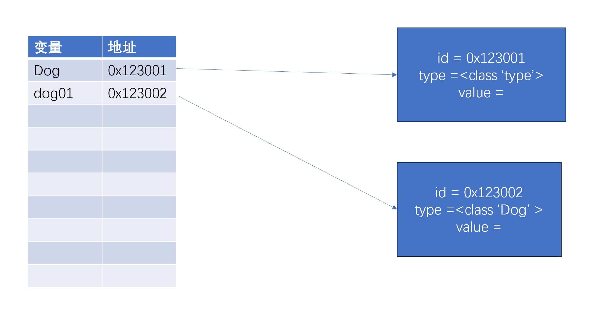
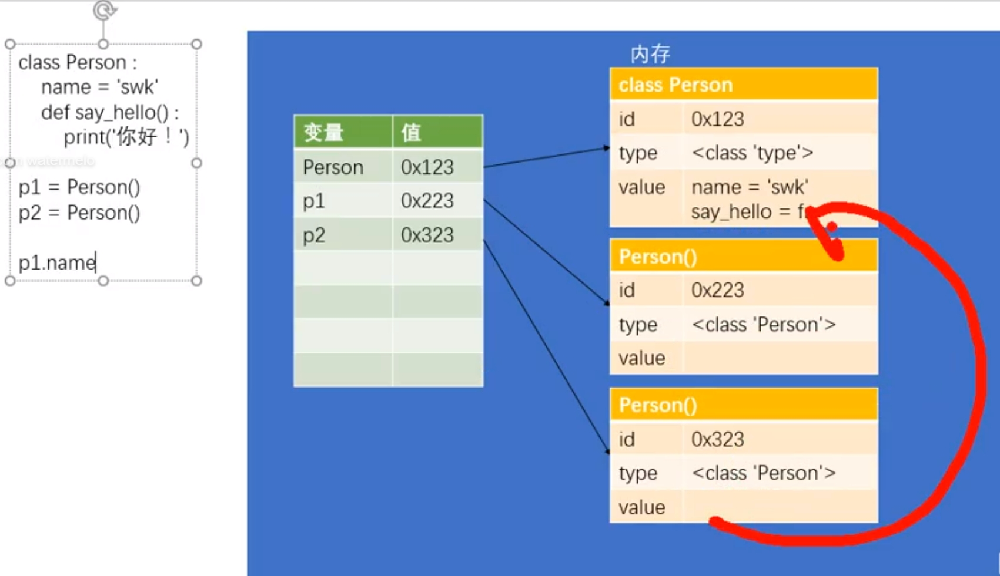
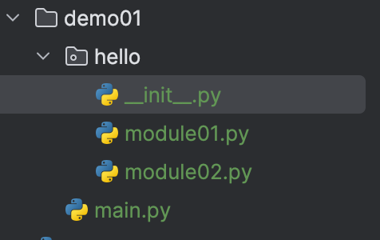

# Python

官方文档:

https://www.python.org/doc/


# 基本语法

## 基本语法

1. 在Python中严格区分大小写

   Java也是

   Node.js也是

2. Python中的每一行就是一条语句

   Java用;分号区分一条语句

   Node.js用;分号区分一条语句，也可以一行是一条语句

3. Python中每一行语句建议不要过长，每一行不超过80字符。

   如果一行语句需要超过80字符，建议多行书写，以\结尾换行

   在 Java 编码规范中，通常建议每行不要超过 80 到 120 个字符。

   Node.js 并没有强制规定每行代码的字符限制，通常，编码规范可能会建议每行不超过80到120个字符

4.  一条语句可以分多行书写，语句背后以\结尾

   ```python
   print('qwertyuiopqwertyuiopqwertyuiopqwertyuiopqwertyuiopqwertyuiopqwertyuiopqwertyui\
   opqwertyuiop')
   print('asdfgghhh')
   print(1+2+3\
         +5+\
         7)
   print(1+
         2
         +3)
   运行结果:
   qwertyuiopqwertyuiopqwertyuiopqwertyuiopqwertyuiopqwertyuiopqwertyuiopqwertyuiopqwertyuiop
   asdfgghhh
   18
   6
   ```
5.   Python是缩进严格的语言，所以在Python中不要随便写缩进

6.   注释
```text
Python
	用#表示单行注释，习惯#后面跟空格
	可以使用三个单引号 ''' 或三个双引号 """ 来创建多行注释

Java用// /**/ /****/表示注释

Javascript用// /**/ /****/表示注释
```

## 字面量和变量

字面量就是一个一个的值，比如1,2,3,4,5,6,'hello'

字面量所表示的意思就是它的字面的值，在程序中可以直接使用字面量

变量(variable)变量可以用来保存字面量，并且变量中保存的字面量是不定的

变量本身没有任何意思，它会根据不同的字面量表示不同的意思

一般我们在开发时，很少直接使用字面量，都是将字符保存到变量中，通过变量来引用字面量


## 变量和标识符

标识符
在Python中所有可以自主命名的内容都属于标识符
比如: 变量名、函数名、类名
标识符必须遵循标识符的命名规范

1. 标识符可以含有字母、数字、_,但不能使用数字开头
2. 标识符不能是Python中的关键字和保留字
       也不建议使用Python中的函数作为标识符，因为这样会导致函数被覆盖
3. 命名规范
   	在Python中注意遵循两种命名规范:
   		下划线命名法
   			所有字母小写，单词之间使用_分割
   			max_length min_length hello_world xxx_yyy_zzz
   		帕斯卡命名法（大驼峰命名法）
   			首字母大写，每个单词开头字母大写，其余字母小写
   			MaxLength MinLength HelloWorld XxxYyyZzz
   如果使用不符合标准的标识符，将会报错语法错误SyntaxError: invalid decimal literal


## 数据类型

Python部分简单数据类型

数值

​	整型

​			布尔值

​	浮点型

​	复数

空字符串

空值


在Python中数值分为三种:整数，浮点，复数
在Python中所有的整数都是int类型

```python
a = 10
b = 20
```


Python中的整数的大小没有限制，可以是一个无限大的整数
```python
c = 9999999999999999999999999999999999999999999999999999999999
print(c)
```

如果数字的长度过大，可以使用下划线作为分隔符
```python
c = 123456789
print(c)
c = 123_456_789
print(c)  # 123456789
```

`d = 0123456` 十进制的数不能以0开头,编辑器会报错
其它进制的整数，只要是数字打印时一定是以十进制的形式显示的
二进制 0b开头
`c = 0b10  # 二进制的10`
八进制 0o开头
`c = 0o10`
十六进制 0x开头
`c = 0x10`
也可以通过运算法来对数字进行运算，并且可以保证整数运算的精确

```python
c = -100
c = c + 3
```

浮点数(小数)，在Python中所有小数都是float类型

```python
c = 1.23
c = 4.56
```

对浮点数进行运算时，可能会得到一个不精确的结果
```python
c = 0.1 + 0.2
print(c) # 0.30000004
```

javascript的数据类型

```text
1. 原始数据类型（Primitive Types）:
Number（数字）:

表示整数或浮点数。
例如：let num = 42;
String（字符串）:

表示文本。
例如：let str = "Hello";
Boolean（布尔）:

表示逻辑值，只能是 true 或 false。
例如：let isTrue = true;
Undefined（未定义）:

表示变量声明但未初始化时的默认值。
例如：let variable;
Null（空值）:

表示没有值或空对象引用。
例如：let value = null;
Symbol（符号）:

引入于 ECMAScript 6，表示唯一的标识符。
例如：let symbol = Symbol("unique");
2. 对象数据类型（Object Types）:
Object（对象）:

表示复杂数据结构。
例如：let person = { name: "John", age: 30 };
Function（函数）:

表示可调用的代码块。
例如：function add(a, b) { return a + b; }
```

java的基本数据类型

```text
1. 整数类型（Integer Types）:
byte:

8位，有符号，范围为 -128 到 127。
short:

16位，有符号，范围为 -32,768 到 32,767。
int:

32位，有符号，范围为 -2^31 到 2^31-1。
long:

64位，有符号，范围为 -2^63 到 2^63-1。
2. 浮点类型（Floating-Point Types）:
float:

32位，单精度。
double:

64位，双精度。
3. 字符类型（Character Type）:
char:
16位，无符号，用于表示字符。
4. 布尔类型（Boolean Type）:
boolean:
用于表示布尔值，只能是 true 或 false。
```


## 字符串

### 字符串
 字符串用来表示一段文本信息，字符串是程序中使用最多的数据类型
 在Python中字符串需要用引号引起来

`s = 'hello'`
s = abc 字符串必须使用银行引起来，不使用不是字符串
引号可以是单引号也可以是双引号，但是注意不要混着用

```python
s = 'hello'
s = 'hello'

s = 'hello" #银行不能混着用,要不然会报SyntaxError: unterminated string literal


```

相同引号之间不能嵌套
s = "子曰："学而时习之，乐呵乐呵""
s = '子曰："学而时习之，乐呵乐呵"'

### 长字符串
单引号和双引号不能跨行使用

```python
s = '锄禾日当午，' \
    '汗滴禾下土。' \
    '谁知盘中餐，' \
    '粒粒皆辛苦。'
```


使用三重引号来表示一个长字符串 ''' """
三重引号可以换行，并且会保留字符串中的格式

```python


s = '''锄禾日当午，
汗滴禾下土。
谁知盘中餐，
粒粒皆辛苦。'''

print(s)
```


### 转义字符

 可以使用 \ 作为转义字符，通过转义字符，可以在字符串中使用一些特殊的内容
 例子：
 \' 表示'
 \" 表示"
 \t 表示制表符
 \n 表示换行符
 \\ 表示反斜杠
 \uxxxx 表示Unicode编码

```python
s = "子曰:\"学而时习之，不亦说乎\""

s = '\u16A1'
print(s)
```


## 字符串拼接

a = 'hello'

### 加法拼接


字符串之间也可以进行加法运算
如果两个字符串进行相加，则会自动将两个字符串拼接为一个

```python
a = 'abc' + 'haha' + '哈哈'
a = 123
a = '一的数字是' + 1  # TypeError: can only concatenate str (not "int") to str
print('a = ' + a)  # 这种写法在python中不常见
```

字符串不能和其他类型进行加减运算，如果做了会出现异常

### print函参打印

```python

a = 123
print('a =', a)
```

### 占位符

在创建字符串时，可以在字符串中指定占位符
%s 在字符串中表示任意字符
%f 浮点数占位符
%d 整数占位符

```python
b = 'Hello %s' % '孙悟空'
b = 'hello %s,你好%s' % ('tom', '孙悟空')
b = 'hello %3s' % '1'  # 至少要占用3个字符，如果不够，则用空格补齐，如果超过3，则和%s一样
b = '%s' % 123.11111  # %s可以作为任何类型数据的占位符
b = '%.1f' % 0.123456  # %.nf,f代表这是个小数，这个n代表小数点后面保留多少位，如果要占位的小数位超过了n，则直接省略不显示
b = '%d' % 1  # %d表示这是整数占位符
print(b)
a = '{name="%s"}' % '张三'
print('a=%s' % a)  # a={name="张三"}
```

### 格式化字符串

可以通过在字符串前添加一个f来创建一个格式化字符串,这种方式只在python3.6以上才有效
在格式化字符串中可以直接嵌入变量

```python
name = '张三'
age = 18
user = f'name={name},age={age}'
print(f'user:{user}')

a = f'你好,小学生{name}'
print(a)
```

### 字符串复制
如果将字符串和数字相乘，则解释器会将字符串重复指定的次数并返回
```python
a = '我爱你'
a = a * 20
print(a) # 我爱你我爱你我爱你我爱你我爱你我爱你我爱你我爱你我爱你我爱你我爱你我爱你我爱你我爱你我爱你我爱你我爱你我爱你我爱你我爱你
```

## 布尔值和空值

### 布尔值(bool)

在python中

布尔值主要用来做逻辑判断

布尔值一共就两个True和False

True表示真，False表示假

```python
a = True

b = False

print('a=',a)
```


布尔值实际上也属于整型，True相当于1，False相当于0

```python
print(1 + True) # 2

```

在Java中，boolean的值有true和false,静态类型语言，不同类型之间不能运算

在js中，boolean的值有true和false，和python一样，布尔值也相当于1，false相当于0


### None(空值)

在Python中，Nonce专门用来表示不存在

```python
b=None

print(b)
```

在Java和js中，null用来表示不存在


## 类型检查

通过类型检查，可以检查指定值(变量)的类型

```python
a =123
b= '123'
print('a=',a)
print('b=',b)
'''
a= 123
b= 123
'''
# a和b打印的值一样，无法看出类型
```

type()用来检查值的类型

该函数会将检查的结果作为返回值返回，可以通过变量来接受函数的返回值


```python
c = type('123')
print(c) # <class 'str'>
d = type(a)
print(d) # <class 'int'>
e = type(b)
print(e) # <class 'str'>

print(type(1)) # <class 'int'>
print(type(1.4)) # <class 'float'>
print(type(True)) # <class 'bool'>
print(type('hello')) # <class 'str'>
print(type(None)) # <class 'NoneType'>
```


在java中可以用instanceof和getClass()做类型检查

在javascript中可以用instalceof、typeof、Object.prototype.toString.call()做类型检查

## 对象(object)

Python 是一门面向对象的编程语言

一切皆对象

程序运行当中，所有的数据都是存储到内存当中然后再运行的

对象就是内存中专门用来存储指定数据的一跨区域

对象实际上就是一个容器，专门用来存储数据

像我们之前学的数值，字符串，布尔值，None都是对象

### 对象的结构

每个对象中都要保存三种数据

* id:标识

  id用来表示对象的唯一性，每一个对象都有唯一的id

  对象的id就相当于人的身份证号一样

  可以通过id()函数来u查看对象

  id是由解析器生成的，在CPython中，id就是对象的内存地址

  对象一旦创建，则它的id永远不能改变

* type:类型

  类型用来表示当前对象所属的类型

  比如：int str float bool....

  类型决定了对象有哪些功能

  Python是一门强类型语言，对象一旦创建类型则不能修改

* value(值)

  值就是对象存储中的具体数据

  对于有些对象的值是可以改变的

  对象分为两大类，可变对象，不可变对象

  ​	可变对象的值可以改变

  ​	不可变对象的值不能改变

```python
a = 123
print("id:",id(a))
print("type:",type(a))
print("value:",a)
'''
对象的结构
id: 140715606595832
type: <class 'int'>
value: 123
'''
```

### 变量和对象

对象没有直接存储到变量中，在Python中变量更像是给对象起了个别名

变量中存储的不是对象的值，而是对象的id(内存地址),

​	当我们使用变量时，实际上就是在通过对象id在查找对象

变量中保存的对象，只有在为变量重新赋值时才会改变

变量和变量之间是相互独立的，修改一个变量不会影响另一个变量

```python
a = 123
b = a
print(id(a)) #140715606595832
print(id(b)) #140715606595832
a =345
print(id(a)) #2211088695728
print(id(b)) #140715606595832
user1 ={"name":"张三","age":12}
user2 = user1
print(id(user1)) #2046136516672
print(id(user2)) #2046136516672
user1['name'] = '李四'
print(user1)#{'name': '李四', 'age': 12}
print(user2)#{'name': '李四', 'age': 12}
print(id(user1)) #2046136516672
print(id(user2)) #2046136516672
user1={'name': '李四', 'age': 12}
print(id(user1)) #3180781599680
print(id(user2)) #3180781666368
print(user1,user2) #{'name': '李四', 'age': 12} {'name': '李四', 'age': 12}
```

所有面向对象语言都一样


## 类型转换

类型转换四个函数

int(),float(),str(),bool()

### int()

规则:

​	布尔值:True->1 False->0

​	浮点数:直接取整，省略后面小数的内容

​	字符串:合法的整数字符串，直接转换为对应的数字

​					如果不是一个合法的整数字符串，则报错ValueError: invalid literal for int() with base

​	对于其他不可转换成整型的对象，则直接抛出异常TypeError: int() argument must be a string, a bytes-like object or a real number, not 'NoneType'

```python
a = True
a = int(a)

print(a) #1

a = 12.222
a= int(a)
print(a) #12

a= '123'
a= int(a)
print(a) #123

a='123.11'
#a= int(a) #ValueError: invalid literal for int() with base 10: '123.11'

a = None
#a = int(a)#TypeError: int() argument must be a string, a bytes-like object or a real number, not 'NoneType'
```

### float()

float()和int()基本一致，不同的是它会将对象转换为浮点

​	布尔值:True->1.0 False->0.0

​	整数:变成n.0的形式

​	字符串:合法的浮点字符串，直接转换为对应的浮点数

​					如果不是一个合法的浮点字字符串，则报错ValueError: could not convert string to float: '12312.ss'

​	对于其他不可转换成整型的对象，则直接抛出异常TypeError: int() argument must be a string, a bytes-like object or a real number, not 'NoneType'

```python
a=True
a=float(a)
print(a)#1.0

a=False
a=float(a)
print(a)#0.0

a='123.011'
a=float(a)
print(a)#123.011

a='12312.ss'
#a=float(a) #ValueError: could not convert string to float: '12312.ss'

a = None
a=float(a) #TypeError: float() argument must be a string or a real number, not 'NoneType'
```

### str()

可以将对象转换为字符串

True->'True'

False->'False'

123->'123'

...

```python
b=123
b=str(b)
print('b=',b)#b= 123
print('type=',type(b))#type= <class 'str'>

b=True
b=str(b)
print('b=',b)#b= True
print('type=',type(b))#type= <class 'str'>

b=None
b=str(b)
print('b=',b)#b= None
print('type=',type(b))#type= <class 'str'>
```

### bool()

可以将对象转换为布尔值，任何对象都可以转换为布尔值

规则：对于所有空性的对象都会转换为False,其余转换为True

哪些表示空性：0，None、''...

```python


c='12321'
c=bool(c)
print('c=',c) # c= True
print('type=',type(c)) #type= <class 'bool'>

c=''
c=bool(c)
print('c=',c) # c= False
print('type=',type(c)) #type= <class 'bool'>

c=None
c=bool(c)
print('c=',c) # c= False
print('type=',type(c)) #type= <class 'bool'>

c=0
c=bool(c)
print('c=',c) # c= False
print('type=',type(c)) #type= <class 'bool'>

c='0'
c=bool(c)
print('c=',c) # c= True
print('type=',type(c)) #type= <class 'bool'>
```


## 算数运算符

### 加法

如果两个字符串之间进行加法运算，则会进行拼串操作

```python
a = 1+1
print(a)
a ='hello' + ' world'
print(a)
```

### 减法

```python
a=10-1
print(a)
```


### 乘法

如果将字符串和数字进行相乘，则会对字符串进行复制操作，将字符串重复指定次数

```python
a=1*10
print(a)
a='张三'*10
print(a)
```


### 除法

运算时结果总会返回一个浮点类型

```python
a=10/2
print(a)
```


### 整除

只会保留计算位的整数位，总会返回一个整型

```python
a=11//2
print(a)
```


### 幂运算

求一个值的几次幂

```python
a=2**10 # 2的10次方幂
print(a)

a= 10**0.5 # 10的开平方根
print(a)
```


### 取模运算

取模，求两个数相除的余数

```python
a=10%4
print(a)
```


## 赋值运算符

= ：可以将等号右侧的值赋值给左侧的变量

+=：a+=5相当于a=a+5

-=：a-=5相当于a=a-5

*=:  `a*=5`想当于`a=a*5`

**=: `a**5`相当于`a=a**5`

/=: `a/=5`相当于a=a/5

//=: a//=5相当于a=a//5

%=: a%=5相当于a=a%5


在对一个浮点数做算数运算时，结果也会返回一个浮点数


## 关系运算符

关系运算符用来比较两个值之间的关系，总会返回一个布尔值

如果关系成立返回True，否则返回False

`>` 比较左侧的值是否大于右侧的值

`>=`比较左侧的值是否大于或等于右侧的值

`<`比较左侧值是否小于右侧值

`<=`比较左侧值是否小于等于右侧值

`==`比较两个对象的值是否相等

`!=`比较两个对象的值是否不相等

​	相等和不相等指的时对象的值，而不是id

is 比较两个对象是否是同一个对象，比较的是对象的id

is not 比较两个对象是否不是同一个对象，比较的是对象的id

```python
a = {'name': '张三'}

b = a

print(b == a) # True
print(b is a) # True
b = {'name': '张三'}
print(b==a) #True
print(b is a) #False,因为id不相等了
```


在Python中可以对两个字符串进行大于(等于)或小于(等于)的运算

对两个字符串进行比较时，实际上比较的是字符串的Unicode编码

比较两个字符串编码时，时逐位比较的

利用该特性可以对字符串按照字母顺序进行排序，但是对于中文来说意义不大

注意:如果不希望比较两个字符串的Unicode编码，则需要将其转换为数字然后再比较

```python

w1='c'
w2='b'
print(w1>w2)#True
w3='cool'
w4='b'
print(w3>w4)#True,和上面结果一致，因为是逐位比较
```


在javascript中

==用来表示两个对象的值是否相等

===相当于python的is，可以判断两个对象是否是同一个对象

在java中

是反过来的

==用来判断两个对象是否是同一个对象

equals用来表示两个对象的值是否一样，但是需要重写类的equals方法


关于str比较大小

javascript中完全一致

java中，只有char能进行大小比较,所以不存在逐位比较的说法


需要注意, 大部分语言，在创建数值对象的时候，都很有可能会被编译器或者虚拟机优化，而且优化策略都有区别，我们不能太过于依赖判断对象是否相同的方法来判断数值是否相同。


## 逻辑运算符

逻辑运算符主要是用来做一些逻辑判断的

### not 非

not可以对符号右侧的值进行非运算

​	对于布尔值，非运算会对其进行取反操作，True变False，False变True

​	对于非布尔值，非运算会将其转换为布尔值，然后再取反

### and 与

and可以对符号两侧的值进行与运算

​	只有在符号两侧的值都为True时，才会返回True，只要有一个False就返回False

​	Python中与运算是短路的与，如果第一个为False，则不会再看第二个值

### or 或

or可以对符号两侧的值进行或运算

​	或运算两个值只要有一个为True，就会返回True

​	Python中或运算是短路的或，如果第一个为True，则不会再看第二个值

```python
a = 0
a=not a
print(a) #True

print(1 and 2) # 2
print(3 and 555) #555
print(not '222' or 'c') #c

True and print('hello world') #hello world
```


非布尔值与或运算

​	当我们对非布尔值进行与或运算时，Python会将其当作布尔值运算，最终会返回原值

​	与运算的规则

​		与运算是找False的，如果第一个值是False，则不看第二个值

​		如果第一个值是False，则返回第一个值，否则返回第二个值

​	或运算的规则

​		或运算是找True的，如果第一个值是True，则不看第二个值

​		如果第一个值是True，则返回第一个值，否则返回第二个值

```python
a = 0
a=not a
print(a) #True

print(1 and 2) # 2
print(3 and 555) #555
print(not '222' or 'c') #c

True and print('hello world') #hello world

# and
# True and True
print(2 and 3) # 3
# True and False
print(2 and 0) # 0
# False and True
print(None and '张三') # None
# False and False
print(0 and '') # 0

# or
# True or True
print(1 or 2) #1
# True or False
print('ss' or None) #ss
# False or True
print('' or 123) # 123
# False or False
print('' or 0)#0
```


## 条件运算符(三元运算符)

语法:  语句1 if 条件表达式 else 语句2

执行流程:

​	条件运算符在执行时，会先对条件表达式进行求值判断

​		如果判断结果为True,则会执行语句1，并返回结果

​		如果判断结果为False,则会执行语句2，并返回执行结果

```python
print('语句1') if True else print('条件2')
```

练习:

​	现在有a,b,c三个变量，三个变量中分别保存有三个值

​		现在通过条件运算符获取三个值的最大值

```python
a = 1
b = 2
c = 3
max = a if a>b else b
max = c if c>max else max
print(max) # 3
```


## 运算符的优先级

和数学中一样，在Python运算也有优先级，比如先乘除，后加减

```python
a = 1 + 2 * 3
print(a) #7
```

运算符的优先级可以根据优先级的表格来查询

在表格中位置越靠下的运算符优先级越高，优先级越高的越优先计算

如果优先级一样则从左向右计算

| 运算符             |
| ------------------ |
| or                 |
| and                |
| not                |
| is,<,>,==,!=,<=,>= |
| ...                |

优先级表格不需要记，如果实际使用时忘记了优先级，则通过小括号来改变运算顺序即可

```python
a = 1 or 2 and 3
print(a) # 1,先and,后or

a = 1 or 2 and 3
print(a) # 1,先and,后or

result =1<2<3
print(result) # True
result = 10<20<14 
print(result)# False
```


 

# 流程控制

Python代码块在执行时是按照自上向下执行的。

通过流程控制语句，可以改变程序执行的顺序，也可以让指定的程序反复执行多次

流程控制语句分成两大类:条件判断语句，循环语句

## 条件判断语句if

语法:

if 条件表达式 :

​	代码块

执行的流程： if语句在执行时，会先对条件表达式进行求值判断

​	如果为True,则执行if后面的语句

​	如果为False,则不执行

默认情况下，if语句只会控制紧随其后的那条语句，如果希望if可以控制多条语句，则可以在if后跟着一个代码块

代码块

​	代码块中保留着一组代码，同一个代码块中的代码，要么都执行要么都不执行

​	代码块就是一种为代码分组的机制

​	如果要编写代码块，语句就不能紧随在:后边，而是要写在下一行

```python
if True: print('我执行了')
if False: print('我没执行了')
print('我肯定执行了')

if True: print('我执行了')
if False: print('我没执行了')
print('我肯定执行了')

a = 11
if a>10:
    print('大家好')
    print(f'我是{a}')
    print('我大于10')
```


可以使用逻辑运算符来连接多个条件

​	如果希望所有条件同时满足，则需要使用and

​	如果希望只要有一个条件满足即可，则需要使用or

```python
a =1
if 10<a<20:
    print('我在10到20之间')

if(a<10 or a>20):
    print('我不在10到20之间')
```


## input函数


input()函数可以获取终端输入的字符串，并返回

input()函数在调用后，程序会立即暂停，等待用户输入

input()函数的返回值是个字符串

input()函数可以设置一个字符串作为参数，这个字符串会作为提示函数:

input()函数也可以用于暂时阻止程序结束


练习

在命令行中，让用户输入一个用户名，获取用户输入，并进行判断

如果用户输入的用户名是admin,则显示欢迎你管理员

如果用户输入的是其他用户名，则什么也不做

```python
username = input("请输入您的用户名:")
if(username == 'admin'):
    print("欢迎你管理员")
input('点击回车键退出程序')
```


## if-else语句  

语法:

​	if 条件表达式 :

​		代码块

​	else:

​		代码块

执行流程:

​	if-else语句在执行时，先对if后的条件表达式进行求值判断

​		如果为True,则执行if后的代码块

​		如果为False,则执行else后的代码块


练习:

让用户在控制台输入一个年龄

如果年龄超过18岁，则显示你已经成年，否则显示你还未成年

```python
age = input("请输入您的年龄：")
age = int(age)
if age >= 18:
    print("您已经成年~~~")
else:
    print("您还未成年~~~")
input("请按Enter键结束程序")
```


## if-else-if

语法:

​	if 条件表达式:

​		代码块

​	elif 条件表达式：

​		代码块

​	elif 条件表达式:

​		代码块

​	...

​	else:

​		代码块

执行流程:

​	if-elif-else语句在执行时，会自上向下依次对条件表达式进行求值判断

​		如果表达式结果为True,则执行当前代码块，然后语句结束

​		如果表达式的结果为False,则继续向下判断，知道找到True为止

​		如果所有的表达式都是False，则执行else后的代码块

```python
grade = 12
if 1 <= grade <= 6:
    print("你读小学")
elif 6 < grade <= 9:
    print("你读初中")
elif 9 < grade <= 12:
    print("你读高中")
elif 12 < grade <= 16:
    print("你读大学")
else:
    print("恭喜你，毕业啦")
```


dead code:

```python
a = 100
if a > 10:
    print("童年已过")
elif a > 20:
    print("少年已过")
elif a > 30:
    print("青年已过")
else:
    print("成仙")
```


## 练习

1. 编写一个程序，获取一个用户输入的整数。然后通过程序显示这个数是奇数还是偶数。

2. 编写一个程序，检查任意一个年份是否是闰年。

   如果一个年份可以被4整除不能被100整除，或者可以被400整除，这个年份就是闰年。

3. 我家的狗5岁了，5岁的狗相当于多大的年龄的人呢？

   其实非常简单，狗的前两年每一年相当于人类的10.5岁，然后每增加一年就增加4岁。

   那么5岁的狗等于人类的年龄就应该是10.5+10.5+4+4+4 = 33岁

4. 从键盘输入小明的期末成绩：

   ​	当成绩为100时，奖励一辆BMW，

   ​	当成绩为[80-99]时，奖励一台iphone，

   ​	当成绩为[60-79]时，奖励一本参考书

   ​	其他时，什么奖励也没有

   

5.  小明正在选择一个可爱的小伙伴一起玩耍，他希望这个小伙伴满足以下条件：

   1. **身高要求：** 大于等于180cm。
   2. **零食数量：** 至少有1000颗零食。
   3. **有趣指数：** 有趣指数在500以上。

   请根据这些条件，告诉小明是否适合选择这个小伙伴，并根据不同的情况给出建议：

   - 如果三个条件同时满足，输出："这个小伙伴真是个超级玩伴，快去邀请他一起玩吧！"
   - 如果三个条件中有至少一个条件满足，输出："这个小伙伴看起来挺不错的，可以考虑和他成为好朋友。"
   - 如果三个条件都不满足，输出："也许还需要再找找，看看有没有更适合你的小伙伴。"


```python
number = input("请输入一个整数:")
number = int(number)
if number % 2 == 0:
    print("这是偶数")
else:
    print("这是奇数")
input("按Enter结束程序")
```

```python
year = input("请输入年份:")
year = int(year)
condition01 = year % 4 == 0 and year % 100 != 0
condition02 = year % 400 == 0
if condition01 or condition02:
    print("这是闰年")
else:
    print("这是平年")
print("按Enter结束程序")
```

```python
dogAge = input("请输入狗的岁数：")
dogAge = int(dogAge)
age = 0
if dogAge - 2 > 0:
    a = dogAge - 2
    age = 2 * 10.5 + a * 4
elif dogAge - 2 >= -1:
    age = dogAge * 10.5
else:
    age = -1

if age == -1:
    print("无效的年龄")
else:
    print(f"相当于人{age}岁")
input("按Enter结束程序")
```

```python
score = input("请输入成绩：")
score = int(score)
if score == 100:
    print("奖励一辆BMW")
elif 80 <= score <= 99:
    print("奖励一台iPhone")
elif 60 <= score <= 79:
    print("奖励一本参考书")
else:
    print("什么奖励都没有")
```

```python
height = int(input("请输入身高(cm):"))
count = int(input("请输入零食数量:"))
index = int(input("请输入有趣指数:"))
con1 = height >= 180
con2 = count >= 1000
con3 = index > 500

c = con1 + con2 + con3
if c == 3:
    print("这个小伙伴真是个超级玩伴，快去邀请他一起玩吧！")
elif c >= 1:
    print("这个小伙伴看起来挺不错的，可以考虑和他成为好朋友。")
else:
    print("也许还需要再找找，看看有没有更适合你的小伙伴。")

```

## 循环语句

循环语句可以使指定的代码块重复指定的次数

循环语句分为两种,while循环和for循环

### while循环

语法:

while 条件表达式:

​	代码块

执行流程:

​	while语句在执行时，会先对while后的条件表达式进行求值判断，

​		如果判断结果为True，则执行循环体(代码块),

​		循环体执行完毕，继续对条件表达式进行求值判断，以此类推，

​		直到判断结果为False，则循环终止,如果循环有对应的else，则执行else后的代码块


```python
i = 0
while i < 10000:
    i += 1
    print(i, 'hello')

else:
    print("over")
```


条件表达式恒为True的循环语句，称为死循环，它会一直运行，慎用!

```python
while True:
    print("hello!!!")
```


练习:

1. 求100以内所有的奇数之和

2. 求100以内所有7的倍数之和，以及个数

3. 水仙花是指一个n位数(n>=3)，它的每个位上的数字的n次幂之和等于它本身(例如:`1**3+5**3+3**3=153`)

   求1000以内所有的水仙花数

4. 获取用户输入的任意数，判断其是否是质数


```python
# 求100以内所有的奇数之和
i = 0
_sum = 0
while i <= 100:
    if i % 2 != 0:
        print(f"{i}是奇数")
        _sum += i
    i += 1
else:
    print(f"奇数的和是{_sum}")  # 2500

```


```python
# 求100以内所有7的倍数之和，以及个数
i = 0
_sum = 0
_count = 0
while i <= 100:
    if i % 7 == 0:
        _sum += i
        _count += 1
    i += 1
else:
    print(f"_sum是{_sum}, 个数是{_count}")  # _sum=735
```


```python
# 水仙花是指一个n位数(n>=3)，它的每个位上的数字的n次幂之和等于它本身
# (例如:`1**3+5**3+3**3=153`)
# 求1000以内所有的水仙花数
i = 1
while i <= 1000:
    str_i = str(i)

    if len(str_i) == 3:
        one = i // 100
        two = (i - one * 100) // 10
        three = i - (one * 100 + two * 10)
        if one ** 3 + two ** 3 + three ** 3 == i:
            print(f"{one}**3+{two}**3+{three}**3={i}")
    i += 1
```


```python
# 获取用户输入的任意数，判断其是否是质数
num = int(input("请输入任意一个整数："))
i = 1
_count = 0
while i <= num:
    if num % i == 0:
        _count += 1
    i += 1
else:
    if _count == 2:
        print("这是一个质数")
    else:
        print("这是一个合数")
```

## break和continue

### break：

break可以用来立即退出循环语句

```python
i = 1
while i <= 10:
    print(i)
    if i == 5:
        continue
    i += 1
'''
1
2
3
4
5
'''
```

### continue:

continue可以用来跳过当次循环

```python
i = 0
while i < 10:
    i += 1
    if i == 5:
        continue
    else:
        print(i)
'''
1
2
3
4
6
7
8
9
10
'''
```

break和continue都只对离他最近的循环起作用

```python
i = 0
while i < 5:
    j = 0
    while j < 5:
        j += 1
        if j == 6:
            break
        print(f"{j}", end='')
    i += 1
    print()
'''
12345
12345
12345
12345
12345
'''
```


### 优化

优化前:

```python
# 优化前
'''
优化前:
范围:10000,时间:6.665999412536621s
范围:20000,时间:29.621161937713623s
'''
start = time()
num = 2
while num <= 20000:
    i = 1
    _count = 0
    while i <= num:
        if num % i == 0:
            _count += 1
        i += 1
    else:
        if _count == 2:
            pass
            # print(f"{num}是质数")
        # else:
        #     print(f"{num}是合数")
    num += 1
end = time()
print(f"执行时间{end - start}s")

```

break优化后：

```python
from time import *

start = time()
num = 2
while num <= 4000000:
    # 3
    j = 1
    _count = 0
    while j <= (num**0.5):
        if(num % j) == 0:
            _count += 1
            if _count >1:
                break
        j = j + 1
    if _count == 1:
        pass

    num = num + 1
end = time()
print(end - start)
```


### 循环嵌套

print函数

一个print函数打印的内容不会换行

每个print函数都会打印一行字符串

如果想让每个print不换行

```python
print("11111111111", end='')
```

循环是可以嵌套的，如果外层循环执行i此，内层循环执行j次，则程序总共执行的次数是i*j

其中外层循环每执行一次，内层循环都要执行j次

1. 打印图形一

   ```text
   *****
   *****
   *****
   *****
   *****
   
   ```

   ```python
   i = 0
   while i < 5:
       j = 0
       while j < 5:
           print("* ", end='')
           j += 1
       print()
       i += 1
   ```

2. 打印图形二

   ```text
   * 
   * * 
   * * * 
   * * * * 
   * * * * * 
   
   ```

   ```python
   i = 0
   while i < 5:
       j = 0
       while j <= i:
           print("* ", end='')
           j += 1
       print()
       i += 1
   ```

3. 打印图形三

   ```python
   * * * * * 
   * * * * 
   * * * 
   * * 
   * 
   
   ```
   
   ```python
   i = 0
   while i < 5:
       j = 0
       while j < 5 - i:
           print("* ", end='')
           j += 1
       print()
       i += 1
   ```
   
   练习
   
   1. 打印九九乘法表
   
   ```text
   1*1=1
   1*2=2 1*3=3
   ...
   ```
   
   2. 求100内所有的质数
   
   答案:
   
   ```python
   i = 0
   while i < 9:
       j = 0
       while j <= i:
           print(f"{i + 1}*{j + 1}={(i + 1) * (j + 1)} ", end='')
           j += 1
       i += 1
       print()
   ```
   
    ```python
    from time import *
    
    start = time()
    num = 2
    while num <= 4000000:
        # 3
        j = 1
        _count = 0
        while j <= (num**0.5):
            if(num % j) == 0:
                _count += 1
                if _count >1:
                    break
            j = j + 1
        if _count == 1:
            pass
    
        num = num + 1
    end = time()
    print(end - start)
    ```
   
   
   

### 优化质数案例

前置知识:

模块:

通过引入模块可以对Python进行扩展

模块引入语法，在文件头部加上

```python
from time import *
```


pass关键字:

在Python中，`pass` 是一个空语句，它不执行任何操作。它通常被用作占位符，用于那些在语法上需要语句但在逻辑上不需要执行任何操作的地方。

```python
if condition:
    pass  # 待实现的代码
else:
    # 其他代码
```


优化前:

```python
from time import *
# 优化前
'''
优化前:
范围:10000,时间:6.665999412536621s
范围:20000,时间:29.621161937713623s
'''
start = time()
num = 2
while num <= 20000:
    i = 1
    _count = 0
    while i <= num:
        if num % i == 0:
            _count += 1
        i += 1
    else:
        if _count == 2:
            pass
            # print(f"{num}是质数")
        # else:
        #     print(f"{num}是合数")
    num += 1
end = time()
print(f"执行时间{end - start}s")

```

break优化后：

```python
from time import *

'''
break优化后:
范围:10000,时间: 2.5416488647460938s
范围:20000,时间: 10.196908473968506s
'''
# 优化前
start = time()
num = 2
while num <= 20000:
    i = 1
    _count = 0
    while i <= num:
        if num % i == 0:
            if _count > 2:
                break
            _count += 1
        i += 1
    else:
        if _count == 2:
            pass
            # print(f"{num}是质数")
        # else:
        #     print(f"{num}是合数")
    num += 1
end = time()
print(f"执行时间{end - start}s")
```

通过条件语句优化后:

```python
from time import *

'''
break优化后:
范围:10000,时间: 1.3319661617279053s
范围:20000,时间: 4.733868360519409s
'''
# 优化前
start = time()
num = 2
while num <= 20000:

    '''
    判断num是不是质数
    '''
    i = 1
    _count = 0
    while i <= num and _count <= 2:
        if num % i == 0:
            if _count > 2:
                break
            _count += 1
        i += 1
    else:
        if _count == 2:
            pass
            # print(f"{num}是质数")
        # else:
        #     print(f"{num}是合数")
    num += 1
end = time()
print(f"执行时间{end - start}s")
```


再优化:

```python
from time import *

'''
break优化后:
范围:10000,时间: 0.11440920829772949s
范围:20000,时间: 0.3162860870361328s
范围:100000,时间: 3.0849106311798096s
'''
# 优化前
start = time()
num = 2
_sum = 100
while num <= _sum:

    '''
    判断num是不是质数
    '''
    i = 1
    _count = 0
    while i <= num and _count <= 2 and i <= _sum ** 0.5:
        if num % i == 0:
            if _count > 2:
                break
            _count += 1
        i += 1
    else:
        if _count == 2:
            pass
            print(f"{num}是质数")
        # else:
        #     print(f"{num}是合数")
    num += 1
end = time()
print(f"执行时间{end - start}s")
```


### 唐僧大战白骨精的游戏

需求:

```text
1. 身份选择
	a. 显示提示信息
		欢迎光临唐僧大战白骨精的游戏！
		请选择你的身份:
			1.唐僧
			2.白骨精
		请选择(1/2): x
	b. 根据用户选择来分配身份（显示不同的提示消息）
		1. 你已经选择唐僧，恭喜你将以唐僧的身份进行游戏！
		2. 什么？你竟然选择了白骨精？太不要脸了，系统将自动分配你为唐僧...
		3. 你输入了个啥？？？系统想了想，决定还是给你分配唐僧角色，嘿嘿。。。
		你的身份是->唐僧<-，你的攻击力是: 2,你的生命值是 2
		你选择你要做的操作: (此处要反复执行)
			1.练级
			2.打BOSS
			3.逃跑

2.游戏进行
	a.显示玩家的基本信息(攻击力 生命值)
	b.显示玩家进行的操作:
		1. 练级
		  恭喜你！->唐僧<-,你升级了！你现在的攻击力是:4,你的生命值是4
		  你选择你要做的操作: (此处要反复执行)
			1.练级
			2.打BOSS
			3.逃跑
		2. 打BOSS
			玩家对BOSS进行攻击，玩家要攻击BOSS，BOSS对玩家进行反击
			计算BOSS是否被玩家消灭，玩家是否被BOSS消灭
			游戏结束
		3. 逃跑
			退出游戏，显示提示信息，游戏结束
```

```python
# 唐僧大战白骨精游戏
user_atk = 2
user_hp = 20
boss_atk = 3
boss_hp = 100

welcome_tip = '欢迎光临唐僧大战白骨精的游戏！'
identify_tip = '''
请选择你的身份:
    1.唐僧
    2.白骨精
请选择(1/2):'''
identify_1 = "你已经选择唐僧，恭喜你将以唐僧的身份进行游戏！"
identify_2 = "什么？你竟然选择了白骨精？太不要脸了，系统将自动分配你为唐僧..."
identify_3 = "你输入了个啥？？？系统想了想，决定还是给你分配唐僧角色，嘿嘿。。。"

info = f'你的身份是->唐僧<-,你的攻击力是: {user_atk}, 你的生命值是:{user_hp}'
op_tip = '''你选择你要做的操作: 
    1.练级
    2.打BOSS
    3.逃跑
请选择(1/2/3):'''
op = 0
op1 = '恭喜你！->唐僧<-,你升级了！你现在的攻击力是:%s,你的生命值是%s'
op3 = '退出游戏，游戏结束'
print(welcome_tip)
identify = input(identify_tip)
print("=" * 40)
if identify == "1":
    print(identify_1)
elif identify == "2":
    print(identify_2)
else:
    print(identify_3)
print(info)
while True:
    print("=" * 40)
    print(f"唐僧 生命值:{user_hp},攻击力:{user_atk}")
    print(f"白骨精 生命值:{boss_hp},攻击力:{boss_atk}")
    op = input(op_tip)
    print("=" * 40)
    if op == '1':
        user_atk += 2
        user_hp += 2
        print(op1 % (user_atk, user_hp))
    elif op == '2':
        print("=" * 18 + "开始战斗" + "=" * 18)
        # TODO 唐僧攻击，白骨精反击，判断唐僧的生命值，判断白骨精的生命值
        boss_hp = boss_hp - user_atk
        print(f"唐僧-->白骨精")
        print(f"唐僧攻击白骨精，白骨精生命值-{user_atk}")
        print(f"白骨精生命值:{boss_hp}")
        if boss_hp <= 0:
            print("恭喜恭喜，白骨精被你打败了")
            input("游戏结束")
            break
        print("=" * 40)
        user_hp = user_hp - boss_atk
        print(f"白骨精-->唐僧")
        print(f"白骨精反击唐僧，唐僧生命值-{boss_atk}")
        print(f"唐僧生命值:{user_hp}")
        print("=" * 18 + "战斗结束" + "=" * 18)
        if user_hp <= 0:
            print("很遗憾,你的血量值小于等于0,你挂了")
            input("游戏结束")
            break
    elif op == '3':
        print(op3)
        input("游戏结束")
        break
```


# 数据结构

## 列表list

列表式Python中的一个对象

对象就是(object)就是内存中专门用来存储数据的一块区域

之前我们学习对象的时候，像素值，它只能保存一个单一的数据

列表中可以保存多个有序的数据

列表式用来存储对象的对象

```python
# 创建列表，通过[]来创建列表
my_list = []  # 空列表
print(my_list, type(my_list))  # [] <class 'list'>

# 列表存储的数据，我们称为元素
# 一个列表中可以存储多个元素，也可以在创建列表时，来指定列表中的元素
my_list = [10]

# 当向列表中添加多个元素时，多个元素之间使用，隔开
my_list = [10, 20, 30, 40, 50]# 创建了一个包含有5个元素的列表

# 列表中可以保存任意的对象
my_list = [10, 'hello', True, None, [1, 2, 3], print]
print(my_list)  # [10, 'hello', True, None, [1, 2, 3], <built-in function print>]

# 列表中的对象都会按照插入的顺序存储到列表中，
#   第一个插入的对象保存到第一个位置，第二个保存到第二个位置
# 我们可以通过索引(index)来获取列表中的元素
#   索引是元素在列表中的位置，列表中的每一个元素都有一个索引
#   索引是从0开始的整数,列表的第一个位置索引为0，第二个位置索引为1，第三个位置索引为2，以此类推
my_list = [10, 30, 20, 60, 50]
print(my_list)

# 通过索引获取列表中的元素
# 语法:my_list[索引] my_list[0]
print(my_list[4])
# 如果使用的索引超过了最大的范围，会抛出异常IndexError: list index out of range
print(my_list[5])

# 获取列表的长度，列表中元素的个数
# len()函数，通过该函数可以获取列表的长度
# 获取到的长度值，是列表的最大索引+1
length = len(my_list)
print(length)#5
```

练习:

​	创建一个列表，在列表中保存你最喜欢的5个颜色的名称

 ```python
colors = ["红色","橙色","黄色","绿色","紫色"]
print(f"红色:{colors[0]}")
print(f"橙色:{colors[1]}")
print(f"黄色:{colors[2]}")
print(f"绿色:{colors[3]}")
print(f"紫色:{colors[4]}")
 ```

### 切片(list[start : end])

切片指从现有列表中，获取一个子列表

创建一个列表，一般创建列表时，变量的名字会使用复数

```python
people = ['孙悟空', '猪八戒', '沙和尚', '唐僧', '蜘蛛精', '白骨精']
```

列表的索引可以是负数
如果索引是负数，则从后面获取元素，-1,表示倒数第一个，-2表示倒数第二个以此类推

```python
print(people[-3])  # 唐僧
```

通过切片来获取指定的元素

语法:

​	列表[起始索引位置:结束索引位置]

通过切片获取元素时,会包括起始索引位置的元素，不会包括结束索引位置的元素

做切片操作时，总会返回一个新的列表，不会影响原来的列表

起始索引位置和结束索引位置都可以省略不写

如果省略结束索引位置，则会一直截取到最后

如果省略起始索引位置，则会从第一个元素开始截取

如果起始索引位置和结束索引位置全部省略，则相当于创建了一个列表的副本

```python
print(people[0:2])  # ['孙悟空', '猪八戒']
p1 = people[1:3]
print(p1)  # ['猪八戒', '沙和尚']
print(people)  # ['孙悟空', '猪八戒', '沙和尚', '唐僧', '蜘蛛精', '白骨精']

print(people[:])  # ['孙悟空', '猪八戒', '沙和尚', '唐僧', '蜘蛛精', '白骨精']
print(people[1:])  # ['猪八戒', '沙和尚', '唐僧', '蜘蛛精', '白骨精']
print(people[:4])  # ['孙悟空', '猪八戒', '沙和尚', '唐僧']
p2 = people[:]
print(id(people), people)  # 2427757121792 ['孙悟空', '猪八戒', '沙和尚', '唐僧', '蜘蛛精', '白骨精']
print(id(p2), people)  # 2427757442944 ['孙悟空', '猪八戒', '沙和尚', '唐僧', '蜘蛛精', '白骨精']
```

### 步长(list[start : end : step])

语法:

  列表[起始索引位置:结束索引位置:步长]

步长表示，每次获取元素的间隔，默认值是1

步长会包括索引的开始位置，从开始位置间隔step计算

步长不能是0，但是可以是负数，如果是0，则会抛出异常ValueError: slice step cannot be zero

如果是负数，则会从列表的后部分向前取元素,步长为负数时,一般不会设置切片开始位置和结束位置

```python
numbers = [0, 1, 2, 3, 4, 5, 6, 7, 8, 9]
print(numbers)  # [0, 1, 2, 3, 4, 5, 6, 7, 8, 9]
print(numbers[::2])  # [0, 2, 4, 6, 8]
print(numbers[1:8:3])  # [1, 4, 7]
# numbers[::0] #ValueError: slice step cannot be zero
print(numbers[::-2])  # [9, 7, 5, 3, 1]
print(numbers[0::])

```


在java中

可以用list.subList(startIndex,endIndex)实现切片的方法

list没有直接的设置步长的方法

list如果要反转，需要使用Collections.reverse(list)方法，但是这个函数改变的是原有的list对象的值


在javascript中

可以使用list.slice(startIndex,endIndex)实现切片的方法

没有直接设置步长的方法

可以使用list.reverse()实现list反转


只有python可以使用负数的索引值从后面开始获取元素

练习:

1. 将两个列表合并成一个列表，比如[1,2,3]+[3,4,5]=>[1,2,3,3,4,5]

2. 将一个列表复制n次,比如[1,2,3]复制两次是[1,2,3,1,2,3]

3. 判断一个元素是否在列表中

4. 判断一个元素是否不在列表中

5. 获取列表元素的个数

6. 获取数值列表中数值最小的值

7. 获取数值列表中数值最大的值

8. 获取一个列表中指定元素的索引位置，如果元素有多个，则允许在list的指定范围内寻找

   比如[1,5,3,6,7,3,2,5,7,8,3,1,2,3,4,6,2],查找元素8的索引位置，则为9，如果找3的索引位置，则可以找到多个，这个时候可以指定范围，比如我要找的位置是大于等于索引0到小于索引4的范围

9. 获取一个列表中指定元素的数量

10. 使用while循环遍历打印list中每一个元素，len(list)函数可以获取list中有多个元素

### 通用操作

#### +

+可以将两个列表拼接为一个列表

```python
add_result = [1, 2, 3] + [3, 4, 5]
print(add_result) #[1, 2, 3, 3, 4, 5]
```

#### *

`*`可以将列表重复指定次数

```python
mul_result = [1, 2, 3] * 3
print(mul_result)  # [1, 2, 3, 1, 2, 3, 1, 2, 3]
```


#### in

in用来检查指定元素是否存在列表中

​	如果存在返回True，否则返回False

```python
people = ['孙悟空', '猪八戒', '沙和尚', '白龙马', '喵喵喵', 
          '白龙马', '白骨精', '蜘蛛精', '喵喵喵', '蝎子精']
print('猪八戒' in people)  # True
if '喵喵喵' in people:
    print('喵喵叫')
```


#### not in

not in 用来检查元素是否不存在与列表中

​	如果不在，返回True, 否则返回False

```python
people = ['孙悟空', '猪八戒', '沙和尚', '白龙马', '喵喵喵',
          '白龙马', '白骨精', '蜘蛛精', '喵喵喵', '蝎子精']
if '蔡徐坤' not in people:
    print('咯咯咯')
```


#### len()

获取列表中所有元素的个数

```python
people = ['孙悟空', '猪八戒', '沙和尚', '白龙马', '喵喵喵',
          '白龙马', '白骨精', '蜘蛛精', '喵喵喵', '蝎子精']
print(len(people)) # 10
```


#### min()

获取列表中的最小值

```python
numbers = [1, 2, 3, 4, 2, -3, 4,
           3.9, 4.5, 9.9, 10.1,
           10.12, 3, 4, 6, 7]
print(min(numbers)) # -3
```


#### max()

获取列表中的最大值

```python
numbers = [1, 2, 3, 4, 2, -3, 4,
           3.9, 4.5, 9.9, 10.1,
           10.12, 3, 4, 6, 7]
print(max(numbers)) #10.12
```

#### list.index(value,start,end)

获取指定元素在列表中第一次出现的索引值

如果列表中没有这个元素，则会抛异常ValueError: xxx is not in list

value: 元素

start: 可选值,查找的开始索引位置 ,大于等于start

end:可选值，查找的结束索引位置, 小于end

```python
numbers = [1, 2, 3, 4, 2, -3,
           4, 3.9, 4.5, 9.9, 10.1,
           10.12, 3, 4, 6, 7]
meta_index = numbers.index(3)
print(meta_index)  # 2
meta_index = numbers.index(3, 3, 13)
print(meta_index)  # 12
```


#### list.count(value)

获取指定元素在列表中的个数

```python
numbers = [1, 2, 3, 4, 2, -3,
           4, 3.9, 4.5, 9.9, 10.1,
           10.12, 3, 4, 6, 7]
meta_count = numbers.count(3)
print(meta_count) # 2
```


## 序列

序列是Python中最基本的一种数据结构

数据结构指的是计算机中存储数据的方式

序列用于保存一组有序数据，所有的数据在序列当中都有一个唯一的位置(索引)

​	并且序列中的数据会按照添加的顺序来分配索引

序列的分类：

​	可变序列（序列中的元素可以改变）:

​		列表(list)

​	不可变序列（序列中的元素不能改变）：

​		字符串(str)

​		元组(tuple)

所以list能用的方法字符串都能用


子序列:

如果序列中的元素也是序列，那么我们称这个元素为子序列

```python
a = [1, 2, [3, 1, 2], 2, 3]
print(len(a)) #5
print(a[2]) #[3, 1, 2]
```


## list()

list()函数可以把不可变序列转成可变序列list

```python
_str = 'hello world'
char_list = list(_str)
print(char_list)  # ['h', 'e', 'l', 'l', 'o', ' ', 'w', 'o', 'r', 'l', 'd']
print(type(str))  # <class 'str'>
print(type(char_list))  # <class 'list'>
```

## list的使用

* 修改元素

对于可变序列，我们可以修改序列中的元素

修改元素，指的都是修改原来的序列对象，而不会创建新的序列对象

### 创建list

list的创建可以通过[]

```python
colors = []
colors = ["红色","橙色","黄色","绿色","紫色"]
```

### 增

#### list.append(value)

向列表的末尾添加一个元素

```python
people = ['张三', '李四', '王老五']
print('改变前的people:', people) #['张三', '李四', '王老五']
people.append('王富贵')
print('改变后的people:', people) #['张三', '李四', '王老五', '王富贵']
```

#### list.insert(index,value)

向列表的指定位置插入一个元素

如果原本位置有元素，原有元素会自动向右移动

参数:

​	要插入的位置

​	要插入的元素

```python
people = ['张三', '李四', '王老五']
people.insert(2, '王老六')
print(people) #['张三', '李四', '王老六', '王老五']
```

#### list.extend([])

两个序列合并,使用新的序列来扩展当前序列

需要一个序列作为参数，它会将该序列中的元素添加到当前列表中

参数：

​	参数: 序列

```python
people = ['张三', '李四', '王老五']
people.extend(['zhangsan','lisi','wanglaowu'])
print(people) #['张三', '李四', '王老五', 'zhangsan', 'lisi', 'wanglaowu']
```

### 改

#### list[index] = value

修改指定索引位置的元素的值，如果索引位置不存在，则会报错#IndexError: list assignment index out of range

```python
numbers = [1, 2, 3, 4]
numbers[3] = 5
print(numbers) #[1, 2, 3, 5]
numbers[99] = 2 #IndexError: list assignment index out of range
```

### 删

#### del

del关键字不要滥用

语法:

del list[index]

如果删除的元素不存在，则会报错KeyError: 'h'

```python
people = ['孙悟空', '猪八戒', '沙和尚',
          '唐僧', '蜘蛛精', '白骨精']
print("修改前:", people)  # 修改前: ['孙悟空', '猪八戒', '沙和尚', '唐僧', '蜘蛛精', '白骨精']
del people[0]
print("修改后:", people)  # 修改后: ['猪八戒', '沙和尚', '唐僧', '蜘蛛精', '白骨精']
```

#### list.clear()

清空序列

```python
people = ['张三', '李四', '王老五']
people.clear()
print(people)#[]
```

#### list.pop()

根据索引删除并返回被删除的元素

如果没有索引值，则删除最后一个元素并返回被删除的元素

参数:

​	可选，索引值

```python
people = ['张三', '李四', '王老五']
meta = people.pop()
print(meta)  # 王老五
print(people)  # ['张三', '李四']
```

#### list.remove(value)

删除指定的元素，如果相同的元素有多个，只会删除第一个

参数:

​	元素值

```python
people = ['张三', '李四', '王老五', '张三']
people.remove('张三')
print(people)#['李四', '王老五', '张三']
```


### 查

#### meta = list[index]
通过索引来查找元素

语法:

meta = list[index]

```python
people = ['孙悟空', '猪八戒', '沙和尚',
          '唐僧', '蜘蛛精', '白骨精']

meta = people[3]
print('people[3]=',meta) #people[3]= 唐僧
```

### 通过切片来修改元素

在给切片进行赋值时，只能使用序列

使用新元素替换旧的元素，如果旧元素的位置不够，会自动增加位置

```python
people = ['孙悟空', '猪八戒', '沙和尚',
          '唐僧', '蜘蛛精', '白骨精']
people[0:2] = ['牛魔王', '红孩儿']
print(people)  # ['牛魔王', '红孩儿', '沙和尚', '唐僧', '蜘蛛精', '白骨精']
people[0:2] = ['牛魔王', '红孩儿', '铁扇公主']
print(people)  # ['牛魔王', '红孩儿', '铁扇公主', '沙和尚', '唐僧', '蜘蛛精', '白骨精']
```

向索引为0的位置插入元素

```python
people = ['孙悟空', '猪八戒', '沙和尚',
          '唐僧', '蜘蛛精', '白骨精']
people[0:0] = ['菩提祖师','太白金星']
print(people)  # ['菩提祖师', '太白金星', '孙悟空', '猪八戒', '沙和尚', '唐僧', '蜘蛛精', '白骨精']
```

使用字符串替换元素时，字符串会转变成序列的形式

给切片进行赋值时，只能使用序列，否则会报错TypeError: can only assign an iterable

```python
people = ['孙悟空', '猪八戒', '沙和尚',
          '唐僧', '蜘蛛精', '白骨精']
people[0:1] = "swk"
print(people)  # ['s', 'w', 'k', '猪八戒', '沙和尚', '唐僧', '蜘蛛精', '白骨精']
people[0:1] = 11 #TypeError: can only assign an iterable
```

当设置步长时，序列中的元素个数必须和切片中的元素的个数一致

```python

people = ['孙悟空', '猪八戒', '沙和尚',
          '唐僧', '蜘蛛精', '白骨精']
new_people = people[::2] = ['张三', '李四', '王老五']
print(people)  # ['张三', '猪八戒', '李四', '唐僧', '王老五', '白骨精']
print(new_people) #['张三', '李四', '王老五']
people[::2] =['张三']  #ValueError: attempt to assign sequence of size 1 to extended slice of size 3
# 根据people和new_people可以看出，切片改变的还是原有的对象
```


del配合切片可以删除序列中的元素

```python
people = ['孙悟空', '猪八戒', '沙和尚',
          '唐僧', '蜘蛛精', '白骨精']
del people[0:2]
print(people) #['沙和尚', '唐僧', '蜘蛛精', '白骨精']

people = ['孙悟空', '猪八戒', '沙和尚',
          '唐僧', '蜘蛛精', '白骨精']
del people[::2]
print(people) #['猪八戒', '唐僧', '白骨精']
```


不可变序列可以进行查询操作，但是不能进行修改操作

```python
str = 'sunwukong'
print(str[2])  # n
s = str[::2]
print(s)  # snuog
str[0] = '1' #TypeError: 'str' object does not support item assignment
str[::2] = ['a'] * 5  # TypeError: 'str' object does not support item assignment
```


### 其它方法

#### list.reverse()

反转列表

```python
people = ['张三', '李四', '王老五']
people.reverse()
print(people)#['王老五', '李四', '张三']
```

#### list.sort()

用来对列表中的元素进行排序，默认是升序排序

如果需要降序排序，则需要传递一个reverse=True作为参数

```python
people = [4, 5, 61, 32, 4, 3, 4,
          6, 7, 8, 434, 3, 2, 4]
people.sort()
print(people)  # [2, 3, 3, 4, 4, 4, 4, 5, 6, 7, 8, 32, 61, 434]
people.sort(reverse=True)
print(people)  # [434, 61, 32, 8, 7, 6, 5, 4, 4, 4, 4, 3, 3, 2]
```


## for循环

语法:

​	for value in 序列:

​		代码块

for循环的代码块会执行多次，序列中有几个元素就会执行几次

​	每执行一次就会将序列中的一个元素赋值给变量

​	所以我们可以通过变量，来获取列表中的元素

```python
people = ['huawei', 'xiaomi', 'tencent', 'alibaba', 'google', 'baidu']
for value in people:
    print(value)
'''
huawei
xiaomi
tencent
alibaba
google
baidu    
'''
```

### enumerate(list)

enumerate()函数可以用来同时获取列表的索引和值，所以我们可以通过这个函数携带索引遍历list

```python
numbers = ['a', 'b', 'c', 'd']
enumerates = enumerate(numbers)
for index, value in enumerates:
    print(index, value)
```


## range()

range()可以生成一个从0开始的整数的序列

r = range(5) # 生成一个长度为5这样的序列[0,1,2,3,4]

语法:

​	参数1：可选，起始值，默认是0

​	参数2:  结束值

​	步长：可选，默认是1

```python
numbers = range(6)
print(numbers)  # range(0, 6)
print(list(numbers))  # [0, 1, 2, 3, 4, 5]
print(list(range(3, 7)))  # [3, 4, 5, 6]
print(list(range(2, 10, 2)))  # [2, 4, 6, 8]
```

作用：

通过range()函数可以创建一个执行指定次数的for循环

for()循环除了创建方式之外，其余都和while一样

​	包括else,包括break,continue都可以在for循环中使用

​	并且for循环使用也更加简单

```python
for i in range(10):
    if i == 5:
        continue
    if i == 8:
        break
    print(i, end="")
else:
    print("执行完毕")
##0123467
```


## EMS员工管理系统

做一个命令行版本的员工管理系统

功能:

​	四个:

​		1.查询

​			显示当前系统中所有的员工

​		2.添加

​			将员工添加到当前系统中

​		3.删除

​			将员工从系统中删除

​		4.退出

​			退出系统

提示:员工信息以下面形式保存

```python
employees = ["孙悟空\t18\t男\t花果山","猪八戒\t16\t男\t高老庄"...]
```


界面提示词:

```python
====================欢迎使用员工管理系统====================
请选择要做的操作:
    1.查询员工
    2.添加员工
    3.删除员工
    4.退出系统
请选择(1-4)
# 如果选择1
=========================================================
序号  姓名	年龄	性别	住址
1    孙悟空 18   男    花果山
====================欢迎使用员工管理系统====================
请选择要做的操作:
    1.查询员工
    2.添加员工
    3.删除员工
    4.退出系统
请选择(1-4)
# 如果选择2
=========================================================
请输入员工的姓名:猪八戒
请输入员工的年龄:18
请输入员工的性别:男
请输入员工的住址:花果山
是否确认该操作[Y/N]:
# 如果选择Y
=========================================================
						添加成功
=========================================================
# 如果选择N
=========================================================
					    添加已取消
=========================================================
# 不管选什么，都会重新显示下面的界面
====================欢迎使用员工管理系统====================
请选择要做的操作:
    1.查询员工
    2.添加员工
    3.删除员工
    4.退出系统
请选择(1-4)
# 如果选择3
请输入要删除的员工的序号:
# 如果输入不合法的数字，则
您的输入有误，请重新输入
# 如果输入的序号合法则
以下员工将被删除
=========================================================
序号  姓名	年龄	性别	住址
1    孙悟空 18   男    花果山
=========================================================
该操作不可恢复，是否确认[Y/N]:
# 如果输入的是N
=========================================================
						操作取消
=========================================================
# 如果输入的是Y
=========================================================
						员工已被删除
=========================================================
# 不管选什么，都会重新显示下面的界面
====================欢迎使用员工管理系统====================
请选择要做的操作:
    1.查询员工
    2.添加员工
    3.删除员工
    4.退出系统
请选择(1-4)
# 如果选择4
=========================================================
					  感谢使用，再见！
=========================================================

```

```python
# 员工管理系统
employees = ["孙悟空\t18\t男\t花果山"]
line = "=" * 60

while True:
    print("=" * 20 + "欢迎使用员工管理系统" + "=" * 20)
    print("请选择要做的操作:")
    print("\t1.查询员工")
    print("\t2.添加员工")
    print("\t3.删除员工")
    print("\t4.退出系统")
    op = int(input("请选择(1-4):"))
    if op == 1:
        print(line)
        print("\t序号\t姓名\t年龄\t性别\t住址")
        i = 1
        for value in employees:
            print(f"\t{i}\t{value}")
            i += 1
        print(line)
    elif op == 2:
        print(line)
        name = input("请输入员工的姓名:")
        age = input("请输入员工的年龄:")
        gender = input("请输入员工的性别:")
        address = input("请输入员工的住址:")

        is_add = input("是否确认该操作[Y/N]:")
        if is_add == 'Y' or is_add == 'y':
            employees.append(f"{name}\t{age}\t{gender}\t{address}")
            print(line)
            print(" " * 24 + "添加成功" + " " * 24)
            print(line)
        else:
            print(line)
            print(" " * 23 + "添加已取消" + " " * 23)
            print(line)
    elif op == 3:
        while True:
            del_num = int(input("请输入要删除的员工的序号:"))
            if 0 < del_num <= len(employees):
                print("以下员工将被删除")
                print(line)
                print("\t序号\t姓名\t年龄\t性别\t住址")
                print(f"\t{del_num}\t{employees[del_num - 1]}")
                print(line)
                is_del = input("该操作不可恢复，是否确认[Y/N]:")
                if is_del == 'Y' or is_del == 'y':
                    employees.pop(del_num - 1)
                    print(line)
                    print(" " * 23 + "员工已删除" + " " * 23)
                    print(line)
                    break
                else:
                    print(line)
                    print(" " * 24 + "操作取消" + " " * 24)
                    print(line)
            else:
                print("您的输入有误，请重新输入")
    elif op == 4:
        print(line)
        print(" " * 22 + "感谢使用，再见！" + " " * 22)
        print(line)
        break
    else:
        print("无效的选择")

```

## 元组tuple

元组是一个不可变的序列

它的操作方式基本上和列表是一致的

所以你在操作元组时，就把元组当成时一个不可变的列表就可以了

一般当我们不希望数据改变时，就可以使用元组，其余情况都使用列表


### 创建元组

​	使用()来创建元组

​		当元组不是空元组时，括号可以省略

​		当元组不是空元组时，它里边至少要有一个逗号,

元组时不可变对象，如果为元组中的元素重新赋值，则会报错:TypeError: 'tuple' object does not support item assignment


```python
my_tuple = ()  # 创建了一个空元组
print(my_tuple)  # ()
print(type(my_tuple))  # <class 'tuple'>

my_tuple = (1, 2, 3, 4, 5)
print(my_tuple[3])  # 4
my_tuple[0] = 1 #TypeError: 'tuple' object does not support item assignment

my_tuple = 1, 2, 3, 4, 5
print(my_tuple)  # (1, 2, 3, 4, 5)
my_tuple = 4,
print(my_tuple)  # (4,)

my_tuple = (0, 1, 2, 3, 4, 5, 1)
t1 = my_tuple[1:3]
print(t1)  # (1, 2)
print(my_tuple.count(1)) # 2
```

练习:

假设a= 2, b=5，请交换a和b的值，让a=5,b=2

```python
a = 2
b = 5
c = a
a = b
b = c
print(a , b) # 5,2
```


### 元组的解包(解构)

解包指的是元组当中每一个元素都赋值给一个变量

在对元组解包时，变量的数量必须和元组中的元素的数量一致

​	如果不一致，则报ValueError: too many values to unpack (expected 2)

也可以在变量前边添加一个*,这样变量将会获取元组中所有剩余的元素

​	但是注意，不能出现两个或两个以上*变量,否则会报:\#SyntaxError: multiple starred expressions in assignment

```python
# 解包
my_tuple = 10, 20, 30, 40
a, b, c, d = my_tuple
print("a=", a)  # a= 10
print("b=", b)  # b= 20
print("c=", c)  # c= 30
print("d=", d)  # d= 40


a, b, c, d = 10, 20, 30, 40
print(a, b, c, d)  # 10 20 30 40

a, b = 10, 20, 30, 40 #ValueError: too many values to unpack (expected 2)

my_tuple = 10, 20, 30, 40
a, *b = my_tuple
print(a, b)  # 10 [20, 30, 40]

*a, b = my_tuple
print(a, b)  # [10, 20, 30] 40

a, *b, c = my_tuple
print(a, b, c)  # 10 [20, 30] 40

my_tuple = 10, 20, 30, 40, 50
a, *b, *c, d = my_tuple #SyntaxError: multiple starred expressions in assignment


```


作用:

交换a和b的值

```python
a, b = 5, 2
a, b = b, a
print(a, b)  # 2 5
```


## 可变对象

每个对象都保存了三个数据:

id(标识)

type(类型)

value(值)

列表就是一个可变对象，一般只在为变量赋值时才是改变变量，其余都是修改对象

```python
# 列表就是一个可变对象
my_list = [1, 2, 3]
# 改对象
# 这个操作是通过变量去修改对象的值
# 这种操作不会改变变量所指的对象
# 当我们去修改对象时，如果有其它变量也指向了该对象，则修改也会在其它的变量中体现
my_list[0] = 10

# 改变量
# 这个操作是给变量重新赋值
# 这种操作会改变变量所指的对象
# 为一个变量重新赋值时，不会影响其它的变量
a = [4, 5, 6]
```


### ==与is

==、!=比较的是对象的值是否相等

is、is not比较的是对象的id是否相等(比较两个对象是否是同一个对象)

```python
a = [1, 2, 3]
b = [1, 2, 3]

print(a is b)  # False
print(a == b)  # True

print(a is not b)  # True
print(a != b)  # False
```


## 字典(map)

使用{}来创建字典

语法:

​	{key1:value1,key2:value2,key3:value3,...}

字典的值(value)可以是任意对象

字典的键可以是任意的不可变对象(int,str,bool,tuple...),但是一般我们都会使用str

​	字典的键是不能重复的，如果出现重复的后边会替换前边的

在字典中根据键(key)来获取值(value)的语法

​	value = map(key)

如果使用字段中不存在的键(key)，会报错\#KeyError: 'key'

```python
d = {}  # 创建字段
print(d, type(d))  # {} <class 'dict'>

_map = {
    "name": "张三",
    10: "我的key是int",
    (2, 3): "我的key是tuple",
    True: "我的key是布尔值"
}

print(_map)  # {'name': '张三',# 10: '我的key是int', (2, 3): '我的key是tuple', True: '我的key是布尔值'}
print(_map[10])  # 我的key是int
print(_map[(2, 3)])  # 我的key是tuple
print(_map[True])  # 我的key是布尔值
print(_map["name"])  # 张三

_map = {
    "name": "张三",
    "name": "李四"
}
print(_map)  # {'name': '李四'}

user = {
    "name":"张三",
    "age": 12
}

print(user['gender']) #KeyError: 'gender'
```


### 字典的使用

#### 创建

1. 使用{}创建

​		语法:{key1:value1,key2:value2,key3:value3,...}

2. 使用dict()函数创建

   该函数每一个参数都是键值对

   这种方式创建的字段，key都是字符串

   ```python
   user = dict(name='孙悟空', age=17, gender='男')
   print(user, type(user))#{'name': '孙悟空', 'age': 17, 'gender': '男'} <class 'dict'>
   ```

   也可以把一个包含有双值的子序列<b>的序列</b> 转换为字典

   双值序列，序列中只有两个值，比如: [1,2]、 ('a','b')、'ab'

   ```python
   user = dict([('name', '孙悟空'), ('age', 18)])
   print(user, type(user)) 
   #{'name': '孙悟空', 'age': 18} <class 'dict'>
   ```


#### 增/改

##### map['key'] = value

语法:

map['key'] = value

如果key存在则覆盖，如果key不存在则添加

```python
user = {'name': '张三', 'age': 18}
user['name'] = '李四'
print(user)  # {'name': '李四', 'age': 18}
user['gender'] = '男'
print(user) #{'name': '李四', 'age': 18, 'gender': '男'}
```

##### map.setdefault(key,value)

如果key已经存在于字典中，则返回key的值，不会对字典做任何操作

如果key不存在，则向字典中添加这个key，并设置value ,然后返回这个key的值

```python
user = {'name': '张三', 'age': 18}
value = user.setdefault('name','李四')
print(user) #{'name': '张三', 'age': 18}
print(value) #张三
value = user.setdefault('gender','男')
print(user) #{'name': '张三', 'age': 18, 'gender': '男'}
print(value) #男
```


##### map.update(new_map)

这个函数会合并两个map，如果遇到冲突的key，则新的map会覆盖旧的map

```python
map1 = {"a": 1, "b": 2, "c": 3}
map2 = {"a": 2, "d": 3, "e": 4}
map1.update(map2)
print(map1)#{'a': 2, 'b': 2, 'c': 3, 'd': 3, 'e': 4}
print(map2)#{'a': 2, 'd': 3, 'e': 4}
```


#### 删

##### del map['key']

注意:不要滥用del关键字，会导致代码难以维护

可以使用del关键字来删除字典中的key-value

语法:

​	del map['key']

如果删除的key不存在，则会报错KeyError: 'h'

```python
words = {'a': 1, 'b': 2,
         'c': 3, 'd': 4,
         'e': 5, 'f': 6, 'g': 7}
del words['a']
print(words)  # {'b': 2, 'c': 3, 'd': 4, 'e': 5, 'f': 6, 'g': 7}

del words['h'] #KeyError: 'h'
print(words)
```

##### map.popitem()

随机删除字典中的一个键值对，一般都会删除最后一个键值对

​	删除之后，它会将删除的key-value作为返回值返回

​	返回的是一个元组，元组中有两个元素，第一个元素是删除的key，第二个是删除的value

如果字典中已经没有任何键值对，也就是{}时，再调用字典的popitem()，则会报错KeyError: 'popitem(): dictionary is empty'

tips:

在Python3.7之前，字典是无序的，在Python3.7之后，字典是有序的

```python
words = {'a': 1, 'b': 2,
         'c': 3}
print(words)#{'a': 1, 'b': 2, 'c': 3}
item = words.popitem()
print(item)# ('c', 3)
print(words)# {'a': 1, 'b': 2}
words.popitem()
words.popitem()
words.popitem() #KeyError: 'popitem(): dictionary is empty'
```


##### map.pop(key)

语法:

​	pop[key[,default]]

根据key删除字典中的key-value

会将被删除的value返回

​	如果删除不存在的key,会抛出异常

​	如果删除不存在的key,但是指定了默认值，则不会抛出异常，而是返回默认值

​	如果删除存在的key,也指定了默认值，则会返回被删除的key对应的value

```python
# 正常删除
words = {'a': 1, 'b': 2,
         'c': 3}
value = words.pop('a')
print(value)  # 1
print(words)  # {'b': 2, 'c': 3}

# 删除存在key，指定default
words = {'a': 1, 'b': 2,
         'c': 3}
value = words.pop('b', 111)
print(value)  # 2
print(words)  # {'a': 1, 'c': 3}

# 删除不存在key,指定default
words = {'a': 1, 'b': 2,
         'c': 3}
value = words.pop('g', 2222)
print(value)  # 2222
print(words)  # {'a': 1, 'b': 2, 'c': 3}

# 删除不存在key,未指定default
words = {'a': 1, 'b': 2,
         'c': 3}
value = words.pop('h')  # KeyError: 'h'
```


##### map.clear()

用来清空字典

```python
words = {'a': 1, 'b': 2,
         'c': 3, 'd': 4,
         'e': 5, 'f': 6, 'g': 7}
words.clear()
print(words) #{}
```


#### 查

##### value = map['key']

语法:

​	value = map['key']

通过[]来获取值时，如果键不存在，会抛出异常KeyError

```python
user = {'name': '张三', 'age': 18}
print(user['name'])  # 张三
age = 'age'
print(user[age])  # 18
```


##### get('key')

语法:

​	get(key[,default])该方法用来根据键来获取字段中的值

​		如果获取的键在字段中不存在，会返回None

​		也可以指定一个默认值，来作为第二个参数，这样获取不到值时将会返回默认值

```python
user = {'name': '张三', 'age': 18}
print(user.get("name"))  # 张三
print(user.get("gender"))  # None
print(user.get("gender", "男"))  # 男
```


#### 其它方法

##### len()

可以获取字典键值对的个数

```python
user = {'name': '张三', 'age': 18}
print(len(user)) #2
```

##### in

检查字典中是否包含指定的键

##### not in

检查字典中是否不包含指定的键

```python
user = {'name': '张三', 'age': 18}
print('name' in user)  # True
print('gender' not in user)  # True
```

##### map.copy()

map的浅复制

改方法用于对字典进行浅复制

复制以后得对象，和原对象是独立的，修改一个不会影响另一个

注意,浅复制会简单复制对象内部的值，如果值也是一个可变对象，这个可变对象不会被复制

```python
a = {"a": 1, "b": "2"}
b = a.copy()
print(id(a), a)#2130285378624 {'a': 1, 'b': '2'}
print(id(b), b)#2130285471936 {'a': 1, 'b': '2'}
a['a'] = 23
# 经过复制后对象是独立的，修改一个不会影响另一个
print(a) #{'a': 23, 'b': '2'}
print(b) #{'a': 1, 'b': '2'}

# 由于是浅复制，修改字典中的对象，原对象会受到影响
d1 = {'a': {'name': '孙悟空', 'age': 10}, 'b': 2, 'c': 3}
d2 = d1.copy()
d1['a']['name'] = '猪八戒'
print(d1)  # {'a': {'name': '猪八戒', 'age': 10}, 'b': 2, 'c': 3}
print(d2)  # {'a': {'name': '猪八戒', 'age': 10}, 'b': 2, 'c': 3}
```

tips:如果要复制一份深层次的副本，需要使用copy模块的deepcopy()函数


### 遍历字典

#### keys()

该函数会返回字典的所有的key

​	该方法会返回一个序列，序列中保存有字典的所有的键

```python
words = {'a': 1, 'b': 2,
         'c': 3, 'd': 4,
         'e': 5, 'f': 6, 'g': 7}

keys = words.keys()
print(keys) #dict_keys(['a', 'b', 'c', 'd', 'e', 'f', 'g'])
for key in keys:
    print(words[key])

```


#### values()

该函数会返回一个序列，序列中保存有字典的所有的值

```python
words = {'a': 1, 'b': 2,
         'c': 3, 'd': 4,
         'e': 5, 'f': 6, 'g': 7}

values = words.values()
print(values)  # dict_values([1, 2, 3, 4, 5, 6, 7])
for value in values:
    print(value)
```


#### items()

该方法会返回字典中所有的项

它会返回一个序列，序列中包含 双值 子序列

双值分别是,字典中的key和value

```python
words = {'a': 1, 'b': 2,
         'c': 3, 'd': 4,
         'e': 5, 'f': 6, 'g': 7}
items = words.items()  
print(items)# dict_items([('a', 1), ('b', 2), ('c', 3), ('d', 4), ('e', 5), ('f', 6), ('g', 7)])
for key, value in items:
    print(f'key:{key},value:{value}')
# key:a,value:1
# key:b,value:2
# key:c,value:3
# key:d,value:4
# key:e,value:5
# key:f,value:6
# key:g,value:7
```


## 集合(set)

集合和列表非常相似

不同点:

1. 集合中只能存储不可变对象
2. 集合中存储的对象是无序(不是按照元素的插入顺序保存)
3. 集合中不能出现重复的元素


### 创建set

#### _set={x,...}

可以使用{}来创建集合

但是要注意,由于空{}是用来创建字典map的,所以通过{}创建集合时，集合里的元素不能为空

```python
s = {4, 2, 1, '2', 2, 'hello', 'cxk'}
print(s, type(s))  # {1, 2, 'cxk', 4, 'hello', '2'} <class 'set'>
s = {}
print(type(s)) #<class 'dict'>
```

集合中只能存储不可变对象,要不然会报#TypeError: unhashable type: 'xxx'

```python
s = {[1,2],'a'} #TypeError: unhashable type: 'list'
print(s)
```

#### _set=set()

也可以使用set()函数创建集合

set()函数可以创建空集合,弥补用{}创建不了空集合的不足

set()函数可以将序列和字典转换为集合

​	使用set()函数将字典转换为集合时，只会包含字典中的键

```python
s = set()
print(s, type(s))  # set() <class 'set'>
# 转换序列
s = set([1, 23, 1, 5, 7, 1, 34, 23])
print(s)  # {1, 34, 5, 7, 23}

s = set('hello world')  
print(s)# {'e', 'd', 'r', ' ', 'o', 'l', 'w', 'h'}

# 转换字典
s = set({
    'a': 1,
    'b': 2,
    'a': 3
})
print(s)  # {'a', 'b'}
```


### 增/改

#### set.add(value)

set.add()函数可以向集合中添加元素

```python
s = set()
s.add(1)
print(s)  # {1}
```

#### set.update(序列/字典)

update()可以将一个集合中的元素添加到当前集合中

update()函数可以传递序列、字典、集合作为参数，字典只会使用键

```python
# 合并序列
s = set('hello')
s.update('world')
print(s)  # {'o', 'l', 'd', 'r', 'h', 'w', 'e'}
# 合并集合
s1 = {1, 1, 1, 3}
s2 = {2, 2, 2, 1}
s1.update(s2)
print(s1)  # {1, 2, 3}
print(s2)  # {1, 2}
# 合并字典
s1 = set('hello')
s1.update({'a': 'world'})
print(s1) #{'h', 'e', 'o', 'l', 'a'}
# 合并集合
s1 = set('hello')
s1.update(set('world'))
print(s1)#{'h', 'o', 'e', 'r', 'l', 'd', 'w'}
```

### 删

#### set.pop()

随机删除一个集合中的元素

```python
s = {4, 2, 1, '2', 2, 'hello', 'cxk'}
print(s) #{1, 2, 'hello', 4, 'cxk', '2'}
s.pop()
# 看似删除了集合中的第一个，但是我们并不知
# 道集合的顺序是怎么排的，这是编译器按照他
# 的规则自己排的，所以我们认为是随机删的
print(s) #{2, 'hello', 4, 'cxk', '2'}
```

#### set.remove(value)

删除集合中的指定元素

```python
s = {4, 2, 1, '2', 2, 'hello', 'cxk'}
s.remove('cxk')
print(s)#{1, 2, 4, '2', 'hello'}
```

#### set.clear()

清空集合

```python
s = {4, 2, 1, '2', 2, 'hello', 'cxk'}
s.clear()
print(s) #set()
```


### 查

集合不能通过set[index]的方式获取值，否则会报TypeError: 'set' object is not subscriptable

因为集合是无序的，也就没有索引值，所以无法指定的集合元素

```python
set1 = {(1, 2), 'apple', 3.14}
print(set1[1])#TypeError: 'set' object is not subscriptable
```

集合中的元素只能遍历

```python
s = {1, 2, 3, 4}
for value in s:
    print(value)
```

### 其它方法

#### in

可以判断集合中是否包含某个元素

#### not in

可以判断集合中是否不包含某个元素

```python
s = {4, 2, 1, '2', 2, 'hello', 'cxk'}
print(4 in s)  # True
print(2 not in s)  # False
```

#### len()

可以获取集合中元素的数量

```python
s = {4, 2, 1, '2', 2, 'hello', 'cxk'}
print(len(s)) #6
```

#### copy()

对集合进行浅复制

由于集合中的元素是不可变的对象

所以被复制的集合的元素也不可改变

```python
# 集合元素是不可变的
set1 = {(1, 2), 'apple', 3.14}
set2 = set1.copy()
print(id(set2), set2)  # 2248156573568 {'apple', (1, 2), 3.14}
print(id(set1), type(set2), set1)  # 2327392408448 <class 'set'> {(1, 2), 3.14, 'apple'}
```


### 集合的运算

集合的概念和数学中的集合一致

集合在做运算时，不会影响原来的集合，而是会返回一个运算结果


#### &交集

```python
s = {1, 2, 3} & {2, 3, 4}
print(s)#{2, 3}
```

#### |并集

相当于两个集合的元素相加，实现的功能与序列的加法类似，但是注意，set没有加法运算

```python
s = {1, 2, 3} | {2, 3, 4}
print(s)#{1, 2, 3, 4}
```

#### -差集

```python
s = {1, 2, 3, 4} - {2, 3}
print(s)  # {1, 4}

s = {1, 2, 3, 4} - {2, 3, 5}
print(s)  # {1, 4}
```


#### ^异或集

例如，考虑集合 A = {1, 2, 3} 和集合 B = {3, 4, 5}，它们的异或集为：

A⊕B=(A∪B)−(A∩B)={1,2,4,5}

也就是：

异或集 = 并集-交集

```python
s = {1, 2, 3, 4} ^ {2, 3}
print(s) #{1, 4}
```

#### <=子集

超集包含了所有子集

这个经常用，通常会被用作判断一个集合元素是否包含了另一个集合元素

```python
s = {1, 2} <= {1, 2, 3, 4}
print(s)  # True

s = {1, 2, 3, 4} <= {1, 2, 3, 4}
print(s)  # True
```


#### <真子集

不包括自己的自己子集叫做真子集

```python
s = {1, 2} < {1, 2, 3, 4}
print(s)  # True

s = {1, 2, 3, 4} < {1, 2, 3, 4}
print(s)  # False
```


#### >=超集

```python
s = {1, 2, 3, 4} >= {1, 2}
print(s)  # True
s = {1, 2, 3, 4} >= {1, 2, 3, 4}
print(s)  # True
```

#### >真超集

不包括自己的超集就是真超集

```python
s = {1, 2, 3, 4} > {1, 2}
print(s)  # True
s = {1, 2, 3, 4} > {1, 2, 3, 4}
print(s)  # False
```

|        | Python | Javascript | Java                                                |
| ------ | ------ | ---------- | --------------------------------------------------- |
| 交集   | &      | 自己写算法 | list1.retainAll(list2)                              |
| 并集   | \|     | 自己写算法 | set1.addAll(set2)                                   |
| 差集   | -      | 自己写算法 | set1.removeAll(set2)                                |
| 异或集 | ^      | 自己写算法 | 自己写算法                                          |
| 子集   | <=     | 自己写算法 | set1.containsAll(set2)                              |
| 真子集 | <      | 自己写算法 | set1.containsAll(set2) && set1.size() > set2.size() |
| 超集   | >=     | 自己写算法 | set2.containsAll(set1)                              |
| 真超集 | >      | 自己写算法 | set2.containsAll(set1) && set2.size() > set1.size() |

所以Python适合做数学工具


# 函数

## 函数简介(function)

​	函数也是一个对象

​	对象是我们内存中专门用来存储数据的一块区域

​	函数可以用来保存一些可执行的代码，并且可以在需要时，对这些语句进行多次的调用

​	创建函数:

​		def 函数名([形参1，形参2,...形参n])

​			代码块

​	函数中保存的代码不会立即执行，需要调用函数才会执行

​	调用函数:

​			函数对象()

```python
def fn():
    print('这是我第一个函数')
    print('hello')
    print('今天天气真不错')


print(fn)  # <function fn at 0x000001C0905FA200>
fn()
fn()
fn()
# 这是我第一个函数
# hello
# 今天天气真不错
# 这是我第一个函数
# hello
# 今天天气真不错
# 这是我第一个函数
# hello
# 今天天气真不错
```


## 函数的参数

在定义函数时，可以在函数名的()中定义数量不等的形参

​	多个形参之间使用,隔开

形参(形式的参数),定义形参就相当于在函数内部声明了变量，但是并不赋值

实参(实际参数)

​	如果函数在定义时，指定了形参，那么在调用函数时也必须传递实参

​	实参将会赋值给对应的形参，简单来说，有几个形参就得传几个实参, 如果实参比形参更少，则会报错TypeError: fn() missing 1 required positional argument: 'b'

​    实参的类型可以是任意类型对象

```python
def fn(a, b):
    print(a + b)
    
fn(1, 1)
```


练习1: 定义一个函数，可以用来求任意三个数的乘积
练习2: 定义一个函数，可以根据不同的用户名显示不同的欢迎信息

```python
def mul(a, b, c):
    print(a * b * c)


mul(1, 2, 3)
```

```python
def welcome(name):
    print(f"欢迎你:{name}")


welcome('张三')
```

### 默认值

一个函数定义形参时，可以为形参指定默认值

指定了默认值以后，如果用户传递了参数则默认值没有任何作用

​	如果用户没有传递，则默认值会生效

```python
def mul(a=10, b=11, c=12):
    print("a=", a)
    print("b=", b)
    print("c=", c)
    print(a * b * c)


mul(1, 2, 3)
'''
a= 1
b= 2
c= 3
6
'''

mul(1)
'''
a= 1
b= 11
c= 12
132
'''
```

### 实参的传递方式

#### 位置参数

位置参数就是将对应位置的实参赋值给对应位置的形参

第一个实参赋值给第一个形参，第二个实参赋值给第二个形参

```python
def mul(a, b, c):
    print(a * b * c)


mul(1, 2, 3)
```


#### 关键字参数

关键字参数，可以不按照形参定义的顺序去传递，而直接根据参数名去传递参数

```python
def mul(a, b, c):
    print("a=", a)
    print("b=", b)
    print("c=", c)
    print(a * b * c)


mul(a=10, c=20, b=30)
```


位置参数和关键字参数可以混合使用

混合使用关键字和位置参数时，必须将位置参数写到前面

```python
def mul(a, b):
    print("a=", a)
    print("b=", b)
    print(a * b)


mul(1, b=2)
mul(1, a=1) #TypeError: mul() got multiple values for argument 'a'
```


### 参数类型

函数在调用时，解析器不会检查实参的类型

实参可以传递任意类型的对象，包括函数

```python
def speak(obj):
    print("id:", id(obj))
    print("type:", type(obj))
    print("value:", obj)
    print("-" * 20)


# 整数
speak(1)
'''
id: 4394055984
type: <class 'int'>
value: 1
'''
# 浮点
_f = 1.11
speak(1.11)
'''
id: 4394742736
type: <class 'float'>
value: 1.11
'''
# bool
speak(True)
'''
id: 4400375056
type: <class 'bool'>
value: True
'''
# str
speak("hello")
'''
id: 4396129648
type: <class 'str'>
value: hello
'''
# None
speak(None)
'''
id: 4400454608
type: <class 'NoneType'>
value: None
'''
```


#### 回调函数

由于函数也是个对象，所以函数也能作为函数的实参，作为实参的函数我们称为回调函数

```python
def speak(obj):
    print("id:", id(obj))
    print("type:", type(obj))
    print("value:", obj)
    print("-" * 20)


def add():
    print("1+1=", 1 + 1)

speak(add)
'''
id: 4456042704
type: <class 'function'>
value: <function add at 0x10999d0d0>
'''
```

回调函数的执行

```python

def speak(obj):
    obj(1, 2)

def add(i, j):
    print(f"{i}+{j}=", i + j)

speak(add)
'''
1+2= 3
'''
```


#### 值传递

数值，字符串，布尔值，浮点等类型的变量在函数中传递数据为值传递，在函数里面修改变量的值不会影响函数外的变量

```python

def print_value(a):
    print("a_id:", id(a))
    a = 2
    print("a_id:", id(a))


b = 1

print("b id:", id(b))
print_value(b)
print("b id:", id(b))

b id: 4455717168
a_id: 4455717168
a_id: 4455717200
b id: 4455717168
```


#### 引用传递

其它高级对象在函数中传递时，传递的是对象的地址，也称为传递的是对象的引用，所以在函数里面修改变量的值会影响函数外的变量

```python
def update_list(a):
    a[1] = 10

list = [1, 2, 3, 4]

update_list(list)
print(list)
```


### 参数的装包(不定长参数)

#### *


在定义函数时，可以在形参前加上一个*，这样这个形参将获取到所有的实参

它将会把所有的实参保存到一个元组中

```python
# *a 会接受所有的位置实参，并且会将这些实参统一保存到一个元组中（包装）
def fn(*a):
    print("a=", a, type(a))


fn(1, 2, 3, 4, 5, 6)
'''
a= (1, 2, 3, 4, 5, 6) <class 'tuple'>
'''
```

带*号的参数只能有一个

带*号的参数可以和其他参数配合使用

可变参数不是必须写在最后，但是注意，带*的参数后的所有参数，必须以关键字参数的形式传递

如果在形参的开头直接写一个*,则要求我们所有的参数必须以关键字参数的形式传递

当函数只有一个带*号的参数时，形参只能接收位置参数，而不能接收关键字参数

```python

# 第一个参数给a，第二个参数给b，剩下的都保存到c的元组中
def fn2(a, b, *c):
    print('a=', a)
    print('b=', b)
    print('c=', c)

fn2(1, 2, 3, 4, 5, 6, 7, 8, 9)
'''
a= 1
b= 2
c= (3, 4, 5, 6, 7, 8, 9)
'''


def fn2(a, *b, c):
    print('a=', a)
    print('b=', b)
    print('c=', c)


fn2(1, 2, 3, 4, c=5)
'''
a= 1
b= (2, 3, 4)
c= 5
'''
# 这样传会报错:TypeError: fn2() missing 1 required keyword-only argument: 'c'
fn2(1, 2, 3, 4, 5) 


# 所有的位置参数都给a,b和c必须使用关键字参数
def fn2(*a, b, c):
    print('a=', a)
    print('b=', b)
    print('c=', c)


fn2(1, 2, 3, b=1, c=2)
'''
a= (1, 2, 3)
b= 1
c= 2
'''

def fn2(*, a, b, c):
    print('a=', a)
    print('b=', b)
    print('c=', c)


fn2(a=1, b=2, c=3)
'''
a= 1
b= 2
c= 3
'''
fn2(1, 2, 3)  # TypeError: fn2() takes 0 positional arguments but 3 were given


# 如果在形参的开头直接写一个*，则要求我们的所有的参数必须以关键字参数的形式传递
def fn2(*, a, b, c):
    print('a=', a)
    print('b=', b)
    print('c=', c)


fn2(a=1, b=2, c=3)
'''
a= 1
b= 2
c= 3
'''
fn2(1, 2, 3)  # TypeError: fn2() takes 0 positional arguments but 3 were given


# 形参只能接收位置参数，而不能接收关键字参数
def fn3(*a):
    print('a=', a)


fn3(1, 2, 3, 4, 5)
'''
a= (1, 2, 3, 4, 5)
'''
fn3(a=1)  # TypeError: fn3() got an unexpected keyword argument 'a'

```


练习:

定义一个函数，可以求任意任意个数值元素的和

```python
def sum(*a):
    print("a:", a)
    print("a:", type(a))
    sum = 0
    for value in a:
        sum += value
    print("sum=", sum)


sum(1, 2, 3, 4, 5, 6, 7, 8, 9)
```


#### **

**形参可以接收其它的关键字参数，他会将这些参数统一保存到一个字典中

​	字典的key就是参数的名字，字典的value就是参数的值

**形参只能有一个，并且必须写在所有参数的最后

```python

def fn3(b, c, **a):
    print('a=', a, type(a))


fn3(1, 2, a=3, g=4)
fn3(1, 2, a=3, b=4) #TypeError: fn3() got multiple values for argument 'b'
```


### 参数的解包(拆包)

#### *

传递实参时，也可以在序列类型的参数前添加星号，这样他会自动将序列中的元素依次作为参数传递

这里要求序列中的元素和形参的个数一致

```python
def fn4(a, b, c):
    print('a=', a)
    print('b=', b)
    print('c=', c)


t = (1, 2, 3)
fn4(*t)
'''
a= 1
b= 2
c= 3
'''
t = [1, 2, 3]
fn4(*t)
'''
a= 1
b= 2
c= 3
'''
fn4(t)  # TypeError: fn4() missing 2 required positional arguments: 'b' and 'c'
```


#### **

我们也可以通过 ** 来对一个字典进行解包操作

对字典进行解包时，也要求字典中的key与形参一一对应

```python
def fn4(a, b, c):
    print('a=', a)
    print('b=', b)
    print('c=', c)


a = {'a': 1000, 'b': 1, 'c': 3}
fn4(**a)
'''
a= 1000
b= 1
c= 3
'''

a = {'a': 1000, 'b': 1}
fn4(**a)  # TypeError: fn4() missing 1 required positional argument: 'c'

a = {'a': 1000, 'b': 1, 'd': 3}
# fn4(**a)#TypeError: fn4() got an unexpected keyword argument 'd'

```

## 函数的嵌套

函数的嵌套就是函数内部还可以定义函数

这种写法在Python中用的不多，但是是可以这样用的

```python
def play():
    def play_ball():
        print("我在里面打ball")

    play_ball()
    print("我在函数里玩")


play()
'''
我在里面打ball
我在函数里玩
'''
```


## 返回值

### return

返回值，就是函数执行以后返回的结果

可以通过return来指定函数的返回结果

我们可以直接使用函数的返回值，也可以通过一变量来接收函数的返回值

return后面跟什么值，函数就会返回什么值

return后面可以跟任意对象，返回值甚至可以是一个函数


```python
def sum(*nums):
    _sum = 0
    for num in nums:
        _sum += num
    return _sum


_sum = sum(1, 2, 3, 4, 6, 2)
print(_sum)

def animal():
    def cat():
        return "I am cat"

    return cat


str = animal()
print(str) #<function animal.<locals>.cat at 0x000002AD14D4BCE0>
print(str()) #I am cat
```

如果仅仅写一个return或者不写return，则相当于return None

```python
def fun3():
    print("hello")
    return

def fun4():
    print("hello")

print(fun3()) #None
print(fun4()) #None
```

在函数中,return后的代码都不会执行,return一旦执行函数自动结束


```python
def fun5():
    return
    print("hello") #不会执行
    
fun5()
```

### return与break的区别

break中断的是循环，return中断的是整个函数, return还可以携带返回值

```python
def fun6():
    for i in range(5):
        if i == 3:
            break
        print("i=", i)
    print("循环结束啦")

print(fun6())
'''
i= 0
i= 1
i= 2
循环结束啦
None
'''

def fun7():
    for i in range(5):
        if i == 3:
            return i
        print("i=", i)
    print("循环结束啦")

print(fun7())
'''
i= 0
i= 1
i= 2
3
'''
```

### fn与fn()的区别

fn是函数对象，打印fn，其实是在打印函数的对象<function fun at 0x0000018A0655F600>

fn()是在执行函数，但因fn()实际上实在打印fn()函数的执行返回值

```python
def fun8():
    return 10

print(fun8) #<function fun8 at 0x0000018A0655F600>
print(fun8()) #10
```


## help()

help函数是Python中的内置函数

作用是通过help()函数可以查询Python中函数的用法

语法:	

​	help(函数对象)

```python
help(print)
'''
Help on built-in function print in module builtins:

print(*args, sep=' ', end='\n', file=None, flush=False)
    Prints the values to a stream, or to sys.stdout by default.

    sep
      string inserted between values, default a space.
    end
      string appended after the last value, default a newline.
    file
      a file-like object (stream); defaults to the current sys.stdout.
    flush
      whether to forcibly flush the stream.
'''
```


## 文档字符串

在定义函数时，可以在函数内部编写文档字符串，文档字符串就是函数的说明

当我们编写了文档字符串，就可以通过help()函数来查看函数的使用说明

文档字符串非常简单，直接在函数的第一行写一个字符串就是文档字符串

```python
def fn(a, b, c):
    '''
    这是一个文档字符串的示例
    :param a: 作用xxx
    :param b: 作用xxx
    :param c: 作用xxx
    :return: 返回值
    '''

    return 10


help(fn)
'''
fn(a, b, c)
    这是一个文档字符串的示例
    :param a: 作用xxx
    :param b: 作用xxx
    :param c: 作用xxx
    :return: 返回值
'''
```

### 类型声明

为了方便其它人查看函数，我们还可以在函数上声明参数类型，返回值类型，但是要注意的是，声明的内容是不参与程序运行的，也就是说，声明了参数类型或者返回值类型，使用函数时，也可以不按照声明去使用函数

```python
def fn(a: str, b: int, c: bool) -> float:
    '''
    这是一个文档字符串的示例
    :param a: 作用xxx
    :param b: 作用xxx
    :param c: 作用xxx
    :return: 返回值
    '''

    return 10


help(fn)
'''
fn(a: str, b: int, c: bool) -> float
    这是一个文档字符串的示例
    :param a: 作用xxx
    :param b: 作用xxx
    :param c: 作用xxx
    :return: 返回值
'''
```


## 作用域

作用域指的是变量生效的区域

在Python中一共有两种作用域

全局作用域

​	全局作用域在程序执行时创建，在程序执行结束时销毁

​	所有函数以外的区域都是全局作用域

​	在全局作用域中定义的变量，都属于<b>全局变量</b>，全局变量可以在程序的任意位置被访问

函数作用域

​	函数作用域在函数调用时创建，在函数结束时销毁

​	函数每调用一次就会产生一个新的函数作用域

​	在函数作用域中定义的变量，都是<b>局部变量</b>，它只能在函数内部中使用

变量的查找

​	当我们使用变量时，会优先在当前作用域中寻找该变量，如果有则使用

​	如果没有则继续去上一级寻找，如果有则使用

​	如果依然没有则继续去上一级作用域中寻找，以此类推

​	直到找到全局作用域，如果依然没有找到，则会抛出异常NameError: name 'a' is not defined

```python
b = 20


def fn():
    # 定义在函数内部，所以他的作用域就是函数内部，函数外部无法访问
    a = 10

    print("函数内部:", 'a=', a)
    print("函数内部:", 'b=', b)


fn()
print('函数外部:', 'b=', b)
print('函数外部:', 'a=', a)  # NameError: name 'a' is not defined

```

```python
a = 30
def fn2():
    #a = 30
    def fn3():
        print('fn3中:', 'a=', a)
    fn3()

fn2()

```


### global

在函数中为变量赋值时，默认都是为局部变量赋值

所以为函数内部的局部变量赋值时，并不会改变外部的全局变量的值

如果 希望在函数内部修改全局变量，则需要使用global关键字来声明变量


被global声明的变量，如果全局没有这个变量，则会在函数内部创建一个新的全局变量，但是要赋值才有意义

​	如果有这个全局有这个变量，则会直接使用外部的全局变量

```python
a = 30

print("刚开始声明时a的id", id(a), "a=", a)


def fn2():
    # a = 20
    print("函数内部的a的id", id(a), "a=", a)


fn2()
print("函数外部的a的id", id(a), "a=", a)
'''
未赋值时:
刚开始声明时a的id 140715048488280 a= 30
函数内部的a的id 140715048488280 a= 30
函数外部的a的id 140715048488280 a= 30
'''
```

```python
a = 30

print("刚开始声明时a的id", id(a), "a=", a)


def fn2():
    a = 20
    print("函数内部的a的id", id(a), "a=", a)


fn2()
print("函数外部的a的id", id(a), "a=", a)
'''
为局部变量赋值时:
刚开始声明时a的id 140715048488280 a= 30
函数内部的a的id 140715048487960 a= 20
函数外部的a的id 140715048488280 a= 30
'''
```

```python
a = 30

print("刚开始声明时a的id", id(a), "a=", a)


def fn2():
    # 声明在函数内部使用的a是全局变量，此时再去修改a时，就是在修改全局的a
    global a 
    a = 20 #修改的是全局变量
    print("函数内部的a的id", id(a), "a=", a)


fn2()
print("函数外部的a的id", id(a), "a=", a)
'''
为局部变量赋值时:
刚开始声明时a的id 140715531685208 a= 30
函数内部的a的id 140715531684888 a= 20
函数外部的a的id 140715531684888 a= 20
'''
```


java没有这种global这种功能

​	java匿名函数引用外部变量时，如果外部变量是基本数据类型，则需要将基本数据类型定义为final

​	如果外部变量是对象，匿名函数可以直接操作这个对象，但是得保证这个对象是effectively final，也就是这个对象的引用不会改变


## 命名空间

命名空间实际上就是一个字典，是一个专门用来存储变量的字典

### locals()

locals()函数可以用来获取当前作用域的命名空间

如果在全局作用域中调用locals()则获取全局命名空间，如果在函数作用域中调用locals()则获取的是函数命名空间

locals()函数返回是一个字典

```python
a = 10
b = 20


def fn1():
    c = 10


_locals = locals()
print(_locals)
'''
{  
    '__name__': '__main__',  
    '__doc__': None,  
    '__package__': None,  
    '__loader__': <_frozen_importlib_external.SourceFileLoader object at 0x00000200A67EBB30>,  
    '__spec__': None,  
    '__annotations__': {},  
    '__builtins__': <module 'builtins' (built-in)>,  
    '__file__': 'C:\\Users\\watermelon\\workspace\\python-lesson\\lesson008\\define_demo17.py',  
    '__cached__': None,  
    'a': 10,  
    'b': 20,  
    'fn1': <function fn1 at 0x00000200A69EBCE0>,  
    '_locals': {...}  
}
'''
_locals['c'] = 30 #虽然可以这样操作，但是不建议
print(c) #30

```
也可以获取函数命名空间
```python
a = 10
b = 20


def fn1():
    c = 10
    fun1_locals = locals() #获取函数命名空间
    print(fun1_locals)  # {'c': 10}


fn1()

```


### globals()

globals()函数可以在任意位置获取全局命名空间

```python
a = 10
b = 20


def fn1():
    c = 10
    fun1_locals = locals() #获取函数命名空间
    print(fun1_locals)  # {'c': 10}
    _global = globals()
    print(_global)
    '''
    {  
    '__name__': '__main__',  
    '__doc__': None,  
    '__package__': None,  
    '__loader__':<_frozen_importlib_external.SourceFileLoader object at 0x00000266EC19BB30>,  
    '__spec__': None,  
    '__annotations__': {},  
    '__builtins__': <module 'builtins' (built-in)>,  
    '__file__': 'C:\\Users\\watermelon\\workspace\\python-lesson\\lesson008\\define_demo17.py',  
    '__cached__': None,  
    'a': 10,  
    'b': 20,  
    'fn1': <function fn1 at 0x00000266EC33BCE0>  
}
    '''

fn1()

```


## 递归函数

使用for循环编写一个函数求10的阶层

```python
def factorial(n: int) -> int:
    _sum = 1
    for i in range(1, n + 1):
        _sum = _sum * i
    return _sum


a = factorial(10)
print(a) #3628800
```

递归函数：

从前有座山，山里有座庙，庙里有个老和尚，老和尚在将故事，故事里说:

​	从前有座山，山里有座庙，庙里有个老和尚，老和尚在将故事，故事里说:

​		...

递归函数简单的理解就是自己去调用自己

无穷递归，如果这个函数一直在自己调用自己，那么程序的内存会溢出，效果类似于死循环

```python
def fn():
    print("从前有座山，山里有座庙，庙里有个老和尚，老和尚在将故事，故事里说:")
    fn()

fn()
```

递归是解决问题的一种方式，它和循环很像

​	它的整体思想是，将一个大问题分解为一个个的小问题，直到问题无法分解时，再去解决问题

递归函数的两个必要条件：

1. 递归条件

   找到什么时候要自己调用自己,还有调用自己的方式是什么，自己调用自己的方式也就是公式

2. 结束条件

   问题可以被分解为的最小问题，也就是递归不再执行的条件


求n的阶乘

```python
'''
求x的阶乘
x * (x-1) * (x-2) * (x-3) ... * 1
即
x *(x-1) * (x-1-1) * (x-1-1-1) ... * 1

 结束条件
    n == 1
 递归条件
    f(n)=n*f(n-1)
'''


def factorial(n: int) -> int:
    if n == 1:
        return 1

    return n * factorial(n - 1)


print(factorial(10))
```


练习:

1. 创建一个函数power来为任意数字做幂运算n**i

   ```python
   '''
   创建一个函数power来为任意数字做幂运算n**i
   
   结束条件:
     i == 0
       return;
   递归公式：
   2**8-->2 *2 *2  *2  *2  *2  *2  *2
     n*f(n,i-1)
   '''
   
   
   def power(n, i):
       if i == 1:
           return n
       return n * pow(n, i - 1)
   
   
   print(power(2, 10))
   
   ```

   

2. 创建一个函数，用来检查一个任意的字符串是否是回文字符串，如果是返回True，否则返回False

   回文字符串，字符串从前往后念和从后往前念是一样的

   ​	abcdefgfedcba

   ```python
   '''
   创建一个函数，用来检查一个任意的字符串是否是回文字符串，如果是返回True，否则返回False
   
   回文字符串，字符串从前往后念和从后往前念是一样的
   0 -1   abcdefgfedcba
   0 -1   bcdefgfedcb
   0 -1   cdefgfedc
   0 -1   defgfed
   0 -1   efgfe
   0 -1   fgf
   
       递归条件:
           fn(_str[1:-1])
       结束条件:
           len(_str) < 2
           _str[0] != _str[-1]
   '''
   
   
   def palindrome(_str):
   
       if len(_str) < 2:
           return True
       if _str[0] != _str[-1]:
           return False
       else:
           return palindrome(_str[1:-1])
   
   print(palindrome("abcdefgfedcba"))
   ```

   

   

   ```python
   '''
   创建一个函数，用来检查一个任意的字符串是否是回文字符串，如果是返回True，否则返回False
   
   回文字符串，字符串从前往后念和从后往前念是一样的
      abcba
   递归公式：
   abcba
   0,4
   1,3
   2,2
   abccba:
   0,5
   1,4
   2,3
   fn(words,n)
   
   结束条件:
       n> = len-1-n:
           return True
       words[start] != words[end]
           return False
   '''
   
   
   def palindrome(_str):
       def is_equals(words, n):
           end = len(words) - 1 - n
           if n >= end:
               return True
           if words[n] != words[end]:
               return False
           return is_equals(words, n + 1)
   
       _words = list(_str)
       return is_equals(_words, 0)
   
   
   print(palindrome('abcba'))
   ```

   

   

3. 求第n个斐波那契数列的值

   ​		比如:1，1，2，3，5，8，13，21，34，55...中

   ​		第4个的值是3

   ​		第5个的值是8

   ```python
   # 斐波那契数列是指这样一个数列：1，1，2，3，5，8，13，21，34，55，89……这个数
   # 列从第3项开始 ，每一项都等于前两项之和。
   # 请打印n位斐波那契数列
   '''
   结束条件:
       n == 1
           return 1
   递归条件
       f(n) = f(n-2)*f(n-1)
   '''
   
   
   def f(n):
       if n == 0:
           return 0
       if n == 1:
           return 1
       else:
           return f(n - 2) + f(n - 1)
   
   print(f(6))
   ```

4. 给两个非空列表，表示两个非负的整数，它们每次都是按照逆序的方式存储，并且列表中的每个元素都只能存储一位大于等于0小于等于9的数字。

   请你加两个数相加，并以相同的形式表示一个和的列表

   你可以假设除了数字0外，这两个数字都不会以0开头

   比如 123+7899=10110

   则 列表1为[3,2,1],列表2为[7,8,9,9],和为[0,1,1,0,1]

   即

   ```python
          123  -->a
       + 9987  -->b
       -------
        10110
   ```

   ```python
   '''
   给你两个 非空 的链表，表示两个非负的整数。它们每位数字都是按照 逆序 的方式存储的，并且每个节点只能存储 一位 数字。
   请你将两个数相加，并以相同形式返回一个表示和的链表。
   你可以假设除了数字 0 之外，这两个数都不会以 0 开头。
   比如
   a = [3,2,1]
   b = [7,8,9,9]
   sum = [0,1,1,0,1]
          123  -->a
       + 9987  -->b
       -------
        10110
   '''
   
   
   def addTwoNumbers(l1, l2):
       '''
       列表求和
       :param l1: 整数1列表
       :param l2: 整数2列表
       :return: 
       '''
       def add(list_a, list_b, c, _sum):
           '''
           使用递归列表求和
           
           结束条件:
             a,b,c都是0
            递归条件：
             当前计算结果的序列
             add(下一个a,下一个b,当前进位,当前计算结果序列)
           :param list_a: 整数1列表
           :param list_b: 整数2列表
           :param c: 进位
           :param _sum: 初始结果列表
           :return: 结果列表
           '''
           if _sum == None:
               _sum = []
   
           if len(list_a) == 0 and len(list_b) == 0 and c == 0:
   
               return _sum
           else:
               a = 0
               if len(list_a) != 0:
                   a = list_a[0]
               b = 0
               if len(list_b) != 0:
                   b = list_b[0]
   
               _sum.append((a + b + c) % 10)  # 计算每一位
               c = (a + b + c) // 10  # 下一个进位
               return add(list_a[1:], list_b[1:], c, _sum)
   
       return add(l1, l2, 0, [])
   
   
   def intToSequence(num: int):
       '''
       将一个自然数倒叙，并存储列表中
       比如1234->[4,3,2,1]
       :param num: 自然数
       :return: 列表
       '''
       num_str = str(num)
       num_list = list(num_str)
       num_list.reverse()
       result = []
       for v in num_list:
           result.append(int(v))
       return result
   
   
   num1 = intToSequence(123)
   num2 = intToSequence(2343242)
   
   s = addTwoNumbers(num1, num2)
   print(s)
   ```

   

## 高阶函数(回调函数)

所谓的高阶函数，其实就是回调函数,就是把函数作为参数

定义一个函数，用于获取一个整数list中所有偶数，并以list的形式返回

```python
def select(_list):
    '''
    获取列表中所有偶数返回
    :param _list:
    :return:
    '''
    _result = []
    for v in _list:
        if v % 2 == 0:
            _result.append(v)

    return _result


result = select([2, 3, 5, 6, 8, 2, 1, 2, 4, 18])
print(result)  # [2, 6, 8, 2, 2, 4, 18]
```

如果说我希望这个函数能自定义返回条件，比如返回list中所有的偶数、返回list中所有大于5的数，返回list中大于2小于5的数，则可以把返回的条件定义成方法，交给调用者决定使用哪个条件。

```python
def select(func, _list):
    '''
    获取列表中所有符合条件的返回
    :param _list:
    :return:
    '''
    _result = []
    for v in _list:
        if func(v):
            _result.append(v)

    return _result


def fun1(meta):
    '''
    判断meta是否是奇数
    :param meta:
    :return:
    '''
    return meta % 2 != 0


def fun2(meta):
    '''
    判断meta是否是偶数
    :param meta:
    :return:
    '''
    return meta % 2 == 0


def fun3(meta):
    '''
    判断meta是否大于5
    :param meta:
    :return:
    '''
    return meta > 5


def fun4(meta):
    '''
    判断meta是否大于2小于5
    :param meta:
    :return:
    '''
    return 2 < meta < 5


params = [2, 3, 5, 6, 8, 2, 1, 2, 4, 18]
result = select(fun4, params)
print(result)  # [2, 6, 8, 2, 2, 4, 18]
```

## filter(condition_func,list)

作用：可以从序列中过滤出符合条件的元素，保存到一个新序列中返回

参数：

1. 函数: 根据该函数来过滤序列(可迭代的结构)
2. 需要过滤的序列(可迭代的结构)

返回值:

​	过滤后的新序列(可迭代的结构)

```python
def condition1(meta):
    '''
    判断meta是否是奇数
    :param meta:
    :return:
    '''
    return meta % 2 != 0


def condition2(meta):
    '''
    判断meta是否是偶数
    :param meta:
    :return:
    '''
    return meta % 2 == 0


def condition3(meta):
    '''
    判断meta是否大于5
    :param meta:
    :return:
    '''
    return meta > 5


def condition4(meta):
    '''
    判断meta是否大于2小于5
    :param meta:
    :return:
    '''
    return 2 < meta < 5


params = [2, 3, 5, 6, 8, 2, 1, 2, 4, 18]
result = filter(condition4, params)
print(list(result))  # [2, 6, 8, 2, 2, 4, 18]
```


## 匿名函数(lambda表达式)

匿名函数，顾名思义，也就是没有名字的函数，它是函数的另一种创建方式

匿名函数，也称为lambda表达式

一个函数只在一个地方被使用时，一般才会被定义成匿名函数，匿名函数一般都会被当成参数使用

语法:

​	lambda 参数列表:返回值

```python
lambda1 = lambda meta: meta % 2 != 0
```

lambda表达式的使用：

```python
lambda1 = lambda meta: meta % 2 != 0

lambda2 = lambda meta: meta % 2 == 0

lambda3 = lambda meta: meta > 5

lambda4 = lambda meta: 2 < meta < 5

params = [2, 3, 5, 6, 8, 2, 1, 2, 4, 18]
result1 = filter(lambda1, params)
result2 = filter(lambda2, params)
result3 = filter(lambda3, params)
result4 = filter(lambda4, params)
```

上面这种使用方法还是太麻烦，再次简化如下

```python
params = [2, 3, 5, 6, 8, 2, 1, 2, 4, 18]
result1 = filter(lambda meta: meta % 2 != 0, params)
result2 = filter(lambda meta: meta % 2 == 0, params)
result3 = filter(lambda meta: meta > 5, params)
result4 = filter(lambda meta: 2 < meta < 5, params)
```


匿名函数的直接调用:

一般情况下，匿名函数都会被当成参数传递给函数使用，而不会直接调用

```python
lambda1 = lambda meta: meta % 2 != 0
result1 = lambda1(3)
print(result1)
# 或者
result2 = (lambda meta: meta % 2 != 0)(3)
print(result2)
```


## map(operation_func,list)

作用：可以迭代对象中所有的元素做指定的操作，然后将其添加到一个新的对象中返回

参数：

1. 函数: 根据该函数来对list中每一项做指定的操作
2. 需要迭代操作的序列(可迭代的结构)

返回值:

​	操作后的新序列(可迭代的结构)

```python
_list = [1, 2, 3, 4, 5, 6, 7, 8, 9, 10]

result = map(lambda x: x * 10, _list)
print(list(result)) #[10, 20, 30, 40, 50, 60, 70, 80, 90, 100]
```


## list.sort(key=func)

该方法可以对列表中的元素进行排序

sort()方法默认返回的是直接比较列表中元素的大小

在sort()可以接受一个关键字参数,key

​	key需要一个函数对象作为参数，当设置了函数对象作为参数

​	则排序的时候每次都会以列表中的一个元素作为参数来调用该函数，并且使用函数的返回值来比较元素的大小

```python
_list = [1, "2", 3, 2, 5, "3", 7, "1", 5, 10]
# _list.sort()#TypeError: '<' not supported between instances of 'str' and 'int'
_list.sort(key=int)  # 将每个元素转成int再比较

print(_list)  # [1, '1', '2', 2, 3, '3', 5, 5, 7, 10]

_list.sort(key=str)  # 将每个元素转成字符再比较
print(_list)  # [1, '1', 10, '2', 2, 3, '3', 5, 5, 7]

_list = ["abc:", "2", "324s", "hello", "ko", "3", 's', "1", "android", "apple"]
_list.sort(key=len)
print(_list)  # ['2', '3', 's', '1', 'ko', 'abc:', '324s', 'hello', 'apple', 'android']
```

## sorted(list,func)

这个函数属于通用的方法，与list.sort()的用法基本一致，但是sorted()可以对任意的序列进行排序

并且，使用sorted()排序不会影响到原来的对象，而是返回一个新的list对象

```python
my_tuple = (1, 2, 4, 5, '1', '100', '2', '28')
result = sorted(my_tuple, key=int)
print(result)  # [1, '1', 2, '2', 4, 5, '28', '100']
print(type(result))  # <class 'list'>

s = 'helloworld'
result = sorted(s)
print(result)  # ['d', 'e', 'h', 'l', 'l', 'l', 'o', 'o', 'r', 'w']
print(''.join(result))  # dehllloorw
```


## 闭包函数

闭包函数是一个被外部函数包裹的函数

闭包函数通常具备以下特点:

1. 闭包函数是一个函数的内部函数
2. 闭包函数可以使用外部的变量
3. 闭包函数会被外部函数包裹
4. 闭包函数会被作为返回值被外部函数返回，然后外部可以调用到闭包函数


闭包函数的作用:

1. 可以延长外部函数局部变量的声明周期
2. 闭包函数可以保护私有变量不被外界访问

下面例子中的averager就是闭包函数

```python
def make_averager():
    numbers = []

    def averager(n):
        numbers.append(n)
        return sum(numbers) / len(numbers)

    return averager


averager = make_averager()
print(averager(1))
print(averager(2))
print(averager(3))

```

### 闭包函数修改无法外层变量

闭包函数属于内层函数，在Python中，内层函数可以访问外层函数的变量，但是内层函数是无法修改外层函数的变量指向的，即使使用了相同变量名

这种情况通常是内层函数使用了外部相同变量名时，内部函数会先创建这个变量副本，然后导致使用这个变量的时候，变量虽然在内层函数创建了，但是还未赋值，所以编译器会报错

比如下面两个例子:

```python
def make_averager():
    numbers = []

    def averager(n):
        numbers = numbers[:] # 这里编译器会报错
        return sum(numbers) / len(numbers)

    return averager


averager = make_averager()
averager01 = make_averager()
print(averager(10))

```

```python
def accumulator():
    '''
      定义一个累加器
    :return: 累加方法
    '''
    a = 0

    def increment():
        a = a + 1 #报错，原因:这里是先创建了一个叫做a的局部
        # 变量，然后再找一个叫做a的变量加1，而刚好本地就有一个局部变量，
        # 但是这个a还未赋值，所以这里编译不通过
        # print(a) #不会报错
        # b = a + 1 #不会报错
        # a = 10 #不会报错

    return increment


increment = accumulator()
increment()
increment()
increment()
increment()
```

那怎么解决相同变量名问题呢？

### nonlocal

nonlocal是Python中的一个关键字，用于声明一个变量不是局部变量，而是外层作用域中的变量。在函数内部使用nonlocal关键字时，它会告诉Python解释器某个变量不是在当前函数内定义的局部变量，而是其外部作用域中定义的一个的变量

nonlocal找的是离当前作用域最近的作用域中的变量

使用案例:

```python
def make_averager():
    numbers = [1]

    def averager(n):
        nonlocal numbers
        numbers = numbers[:] #编译不会报错了
        return sum(numbers) / len(numbers)

    return averager


averager = make_averager()
averager01 = make_averager()
print(averager(10))
```


```python
def accumulator():
    '''
      定义一个累加器
    :return: 累加方法
    '''
    a = 0

    def increment():
        nonlocal a
        a = a + 1 #编译不会报错了

    return increment


increment = accumulator()
increment()
increment()
increment()
increment()

```


### 与Java语言的区别

在Java中，可以展示类似闭包的行为，但是由于Java的匿名内部类的方法要调用外部方法时，外部方法的局部变量必须使用final修饰，这主要是因为Java要实现向老版本兼容的特性，而Java8之前已经规定了这个外部对象必须是final或者事实上是final

其他语言，外部的局部变量定义了，还能修改变量的值，甚至是变量的引用指向，而Java因为被final修饰，所以不能修改。

比如下面这点，Java就做不到:

```python
def accumulator():
    '''
      定义一个累加器
    :return: 累加方法
    '''
    a = 0

    def increment():
        nonlocal a
        a = a + 1
        print(a)

    a = 2 # 这种写法在Java是不被允许的，在Python可以
    return increment


increment = accumulator()
increment()
increment()
increment()
increment()
```


Java实现类似闭包的案例:

```python
package closure.demo;

import java.util.ArrayList;
import java.util.List;

public class ClosureDemo01 {
    public interface MakeAveragerInterface {
        Double averager(int value);
    }

    public static MakeAveragerInterface makeAverager() {
        List<Integer> numbers = new ArrayList<>();

        return value -> {
            numbers.add(value);
            int sum = 0;
            for (Integer number : numbers) {
                sum += number;
            }
            return sum / Integer.valueOf(numbers.size()).doubleValue();
        };
    }

    public static void main(String[] args) {
        MakeAveragerInterface makeAverager = makeAverager();
        System.out.println(makeAverager.averager(1));
        System.out.println(makeAverager.averager(2));
        System.out.println(makeAverager.averager(3));
    }
}
```


Java只能展示类似闭包行为的证据:

```java
package closure.demo;


public class ClosureDemo02 {
    public interface MakeAveragerInterface {
        Double averager(int value);
    }

    public static MakeAveragerInterface makeAverager() {
        int a = 1;

        return value -> {
            /**
             * Java只能展示类似闭包的行为，但这和真正的闭包还是有区别的。
             * 比如:
             *  这种情况下编译不通过，因为java的匿名内部类使用外部对象的时候，外部对象一定要被final修饰
             *  是不能修改外部方法对象的引用的，而其他语言的真正闭包，是能做到这一点的
             */
            a = value;
        };
    }

    public static void main(String[] args) {
        MakeAveragerInterface makeAverager = makeAverager();
        System.out.println(makeAverager.averager(1));
        System.out.println(makeAverager.averager(2));
        System.out.println(makeAverager.averager(3));
    }
}
```

## 装饰器

装饰器是一种特殊的语法，主要用于在不修改原有函数的情况下，增强函数的功能

### 装饰器概念的引入


下面就是一种装饰器的实现

```python
# 装饰器的引入
def add(x, y):
    return x + y


def mul(x, y):
    return x * y


def hello():
    print('hello')


# 需求:要求将在函数执行前打印程序开始执行，函数执行完毕后打印程序结束执行
def my_decorator(func):
    def do(*x, **y):
        print("程序开始执行")
        r = func(*x, **y)
        print("程序结束执行")
        return r

    return do


my_decorator_do = my_decorator(mul)
r = my_decorator_do(2, 3)
print(r)
'''
程序开始执行
程序结束执行
6
'''

my_decorator_do = my_decorator(add)
r = my_decorator_do(2, 3)
print(r)
'''
程序开始执行
程序结束执行
5
'''

my_decorator_do = my_decorator(hello)
r = my_decorator_do()
print(r)
'''
程序开始执行
hello
程序结束执行
None
'''
```


### 装饰器的使用@装饰器

像my_decoratorz这种函数我们就称它为装饰器

​	通过装饰器，可以在不修改原来函数的情况下对函数进行扩展

​	在开发中，我们都是通过装饰器来扩展函数的功能的

在定义函数时，可以通过@装饰器来使用指定的装饰器，来装饰当前的函数

​	我们可以同时为一个函数指定多个装饰器，这样函数将会按照从内向外的顺序被装饰

```python
# 需求:要求将在函数执行前打印程序开始执行，函数执行完毕后打印程序结束执行
def my_decorator(func):
    def do(*x, **y):
        print("程序开始执行")
        r = func(*x, **y)
        print("程序结束执行")
        return r

    return do


def my_decorator2(func):
    def do(*x, **y):
        print("程序2开始执行")
        r = func(*x, **y)
        print("程序2结束执行")
        return r

    return do


# 装饰器的引入
@my_decorator
@my_decorator2
def add(x, y):
    return x + y


@my_decorator
def mul(x, y):
    return x * y


@my_decorator
def hello():
    print('hello')


r = add(1, 2)
print(r)
'''
程序开始执行
程序2开始执行
程序2结束执行
程序结束执行
3
'''

r = mul(1, 2)
print(r)
'''
程序开始执行
程序结束执行
2
'''

r = hello()
print(r)
'''
程序开始执行
hello
程序结束执行
None
'''

```

# 面向对象

## 面向对象的概念

一切皆对象

面向对象三大特性:

封装:保护对象中的数据安全

继承:保证了对象的可扩展性

多态:保证了对象的灵活性


## 类 class

### 类的简介

我们目前所学习的对象都是Python内置的对象，比如:

但是内置对象并不能满足所有的需求，所以我们在开发中经常需要自定义一些对象

```python
a = int(10)  # 创建一个int类的实例
b = str('hello')  # 创建一个str类的实例
print(a, type(a))  # 10 <class 'int'>
print(b, type(b))  # hello <class 'str'>
```


类，简单理解就相当于一个图纸。在程序中我们需要根据类来创建对象

类就是对象的图纸！

我们也称对象是类的实例(instance)

如果多个对象是通过一个类创建的，我们称这些对象是一类对象

像list()、set()、dict()、int()、str()、float()...等，这些都是类

a = int(10) 就相当于创建了一个int类的实例 等价于 a = 10

我们自定义的类都需要使用大写字母开头，使用大驼峰命名法来对类命名

类的语法:

class 类名([父类])：

​	代码块

使用类创建对象，就像调用函数一样

```python
# 定义一个类
class Dog:
    pass


# 直接打印类
print(Dog)  # <class '__main__.Dog'>

# 创建类的对象/类的实例化
dog1 = Dog()
dog2 = Dog()
dog3 = Dog()
print(dog1, id(dog1), type(dog1))  # <__main__.Dog object at 0x00000192A4187E60> 1729329921632 <class '__main__.Dog'>
print(dog2, id(dog2), type(dog2))  # <__main__.Dog object at 0x00000192A4187DD0> 1729329921488 <class '__main__.Dog'>
print(dog3, id(dog3), type(dog3))  # <__main__.Dog object at 0x00000192A4187E00> 1729329921536 <class '__main__.Dog'>
```

### isinstance(obj,className)

这个函数可以判断这个对象是否是这个类实例化的

如果这个类是这个对象的父类，也会返回True

语法:

​	参数1: 实例化后的对象

​	参数2:类名

返回:

​	布尔值

```python
# 定义一个类
class Dog:
    pass


# 直接打印类
print(Dog)  # <class '__main__.Dog'>

# 创建类的对象/类的实例化
dog1 = Dog()

print(isinstance(dog1, Dog)) #True
print(isinstance(dog1, str)) #False
print(isinstance(dog1, int)) #False
```


### 类的本质

类也是一个对象

类就是一个用来创建对象的对象

类是type类型的对象，定义类实际上就是定义了一个type类型的对象

```python
# 定义一个类
class Dog:
    pass


print(Dog, id(Dog), type(Dog))  # <class '__main__.Dog'> 2123576889728 <class 'type'>
# Dog其实是type类型的对象，定义类其实就是使用Dog这个变量接收了一个type类型的对象
# 我们可以给Dog这个变量重新赋值
Dog = 1
print(Dog, id(Dog), type(Dog))  # 1 140715510843832 <class 'int'>
```


### 使用类创建对象的流程

1. 创建一个变量dog
2. 在内存中创建一个新对象
3. 将对象的id赋值给变量



下面我们通过Dog类创建的对象都是空对象

空对象也就是对象中实际什么都没有，就相当于一个空盒子

可以动态的向对象中添加变量，对象中的变量称为属性

语法: 对象.属性名 = 属性值

```python
# 定义一个类
class Dog:
    pass


dog = Dog()
dog.name = '旺财'
print(dog.name) #旺财
```


### 类的定义

类和对象都是对现实生活中事物或程序中内容的抽象

实际上所有的事物都由两部分构成

1. 数据(属性)
2. 行为(方法)

在类的代码块中，我们可以定义变量和函数

​	变量会成为该实例的公共属性，所有的该实例都可以通过 对象.属性名 的形式访问

​	函数会成为该类实例的公共方法，所有该类实例都可以通过对象.方法名()的形式调用

注意:

​	方法调用时，第一个参数由解析器自动传递，所以定义方法时，至少要定义一个形参！

```python
# 定义一个类
class Person:
    name = 'wjh'

    def say_hello():
        # 这里会报错：TypeError: Person.say_hello() takes 0 positional arguments but 1 was given
        # 因为使用对象.方法()的方法调用时，第一个参数由解析器自动传递，所以定义方法时，至少要定义一个形参
        print("你好!")

p1 = Person()
p2 = Person()
p1.say_hello()
p2.say_hello()
```


正确写法：

```python
# 定义一个类
class Person:
    name = 'wjh'

    def say_hello(self):
        print("你好!")


p1 = Person()
p2 = Person()
p1.say_hello()  # 你好!
p2.say_hello()  # 你好!
```


#### 方法调用和函数调用的区别

如果是函数调用，则调用时传几个参数，就会有几个实参

但是如果是方法调用，默认传递一个参数，所以方法中至少要定义一个形参


### 属性和方法

#### 属性和方法的查找流程

当我们调用一个对象的属性时，解析器会先在当前对象中查找是否含有该属性

如果有，则直接返回当前对象的属性值

如果没有，则去当前对象的类对象中寻找，如果有则返回类对象的属性值，如果没有则报错！



```python
# 定义一个类
class Person:
    name = 'wjh'

    def say_hello(self):
        print("你好!")


p1 = Person()
p1.name = 'laimin'
print(p1.name)  # laimin 在实例对象中查到的属性值

p2 = Person()
print(p2.name)  # wjh 在类对象中查找到的属性值
```


类对象和实例对象中都可以保存属性和方法

如果这个属性或方法是所有实例共享的，则应该保存到类对象中

如果这个属性是某个实例独有，则应该保存到实例对象中

一般情况下，属性保存到实例对象中

而方法需要保存到类对象中


#### self

对象的方法每次被调用时，解析器都会自动传递第一个实参，一般我们会将这个参数命名为self

第一个参数，就是调用方法的对象本身，

​	如果调用者是p1,则第一个参数就是p1对象

​	如果调用者是p2,则第一个参数就是p2对象

在对象的方法中，我们是不能直接使用方法的属性的，只能通过self.属性名的方式使用

```python
class Person:
    name = 'wjh'

    def say_hello(self):
        print("你好!%s" % self.name)  # 直接使用时报错：NameError: name 'name' is not defined. Did you mean: 'self.name'?


p1 = Person()
p1.name = 'laimin'
p1.say_hello()  # 你好!laimin

p2 = Person()
p2.name = 'miaomiaomiao'
p2.say_hello()  # 你好!miaomiaomiao

p3 = Person()
p3.say_hello()  # 你好!wjh
```


### 类的初始化init

`__init__(self)`方法会在对象创建时立刻执行

init函数可以用来向新创建的对象中初始化属性

调用类创建对象时，类后边的所有参数都会依次传递到init()中

init函数的self参数也是编译器自动传入的，它代表对象本身

我们可以通过init的self参数向新建的对象中初始化属性

```python
class Person:

    def __init__(self, name):
        self.name = name

    def say_hello(self):
        print("你好!%s" % self.name)  # 直接使用时报错：NameError: name 'name' is not defined. Did you mean: 'self.name'?


# p1 = Person() #TypeError: Person.__init__() missing 1 required positional argument: 'name'

p1 = Person("张三")
p1.say_hello()  # 你好!张三
p2 = Person("李四")
p2.say_hello()  # 你好!李四
```


使用init函数的好处：

如果我们将设置属性值放在实例化对象之后，那很有可能有些必要属性会忘记设置，所以这种方式很适合设置必要属性，必要属性如果没设置，则对象无法创建


创建对象的流程

1. 创建一个变量
2. 在内存中创建一个新对象
3. `__init__(self)`方法执行
4. 将对象的id赋值给变量


这个地方我们要注意，类中也是可以写代码块的，类中的代码块会在类对象被创建的过程中执行的，且类体中的代码块只执行一次，而不是在每次创建类实例的适合执行，这些代码块的执行过程主要用于初始化类的属性，方法等结构，比如:

```python
class Person:

    print("我是代码块")
    def __init__(self, name):
        self.name = name

    def say_hello(self):
        print("你好!%s" % self.name)

p1 = Person("张三")
p1.say_hello() 
p2 = Person("李四")
p2.say_hello()  
'''
我是代码块
你好!张三
你好!李四
'''
```


### 类的基本结构

```python
class 类名([父类]):
    公共的属性...
    
    # 对象的初始化方法
    def __init__(self,...):
        ...
    
    # 其他的方法
    def method_1(self,...):
        ...
    
    def method_2(self,...):
        ...
    ...
```


练习:

自定义一个类叫做Cat

属性:

​	name,age,gender,color

方法:

​	catch_mouse(),eat(),meow()

```python
class Cat:

    def __init__(self, name, age, gender, color):
        self.name = name
        self.age = age
        self.gender = gender
        self.color = color
        print(f"大家好，我是{self.name},我的年龄是{self.age},我的性别是{self.gender},我的颜色是{self.color}")

    def catch_mouse(self):
        print("我在抓老鼠")

    def eat(self):
        print("我在吃喵喵粮")

    def meow(self):
        print("喵~喵~喵~喵~喵~")


cat = Cat('喵喵喵', 3, '女', '橘色')
cat.catch_mouse()
cat.eat()
cat.meow()
'''
大家好，我是喵喵喵,我的年龄是3,我的性别是女,我的颜色是橘色
我在抓老鼠
我在吃喵喵粮
喵~喵~喵~喵~喵~
'''
```

## 封装

封装是面向对象的三大特征之一

封装指的是隐藏对象中一些不希望被外部所访问到的属性或方法

如何隐藏一个对象中的属性？

​	将对象的属性名，修改为一个外部不知道的名字

如何获取(修改)对象中的属性？

​	需要提供一个getter和setter方法使外部可以访问到属性

​	getter获取对象中指定属性(get_属性名)

​	setter用来设置对象的指定属性(set_属性名)

使用封装，确实增加了类的定义的复杂程度，但是它也确保了数据的安全

1. 隐藏了属性名，使调用者无法随意的修改对象中的属性

2. 增加了getter和setter方法，很好的控制属性是否是只读的

   如果希望属性是只读的，则可以直接去掉setter方法

   如果希望属性不能被外部访问，则可以直接去掉getter方法

3. 使用setter方法设置属性，可以增加数据的验证，确保数据的值是正确的

4. 使用getter方法获取属性，使用setter方法设置属性

   可以在读取属性和修改属性的同时做一些其它的处理

```python
class Cat:

    def __init__(self, name):
        self._name = name

    def get_name(self):
        return self._name

    def set_name(self, name):
        self._name = name

    def meow(self):
        print(f'大家好,我是{self._name}')


cat = Cat('喵喵喵')
cat.set_name('张三')
cat.meow()
print(cat.get_name())

'''
大家好,我是张三
张三
'''
```


Python无法完全隐藏变量或者属性，只能用一些自欺欺人的办法，比如上面用了_name，很多地方也用__name


### __隐藏属性

__xx这种双下划线的方式可以隐藏对象的属性，隐藏的属性只能在类的内部访问，无法通过对象访问

但是，其实这种方法也只是编译器将属性的名字改为了_类名__属性名

这种方式的本质和单下划线_属性名一样，都是防君子不防小人

所以为了方便，很多人还是更喜欢用单下划线

```python
class Cat:

    def __init__(self, name):
        self.__name = name

    def get_name(self):
        return self.__name

    def set_name(self, name):
        self.__name = name

    def meow(self):
        print(f'大家好,我是{self.__name}')


cat = Cat('喵喵喵')
cat._Cat__name = '张三'
cat.meow()
print(cat.get_name())
print(cat.__name) #AttributeError: 'Cat' object has no attribute '__name'

'''
大家好,我是张三
张三
'''
```


   ### @property、@xx.setter

get方法的装饰器:

property装饰器

用来将一个get方法，转换为对象的属性

添加为property装饰器以后，我们就可以像调用属性一样使用get方法了

**使用property装饰的方法，必须和属性名一样**


set方法的装饰器: 

@属性名.setter

注意，这个装饰器在使用前一定要配合@property使用，要不然会报错

```python
class Cat:

    def __init__(self, name):
        self._name = name

    @property
    def name(self):
        print("获取方法执行了")
        return self._name

    @name.setter
    def name(self, name):
        print("设置方法执行了")
        self._name = name

    def meow(self):
        print(f'大家好,我是{self._name}')


cat = Cat('喵喵喵')
cat.name = '李四'
cat.name
cat.meow()
'''
设置方法执行了
获取方法执行了
大家好,我是李四
'''
```


## 继承

通过继承可以直接让子类获取到父类的方法或属性，避免编写重复性的代码，所以我们经常需要通过继承来对一个类进行扩展

继承是面向对象三大特性之一

通过继承我们可以使一个类获取到其它类的属性和方法

在定义类时，可以在类名后的括号中指定当前类的父类(超类，基类，super)

​	子类(衍生类)可以直接继承父类中的所有的属性和方法


在创建类时，如果省略了父类，则默认父类为object

​	object是所有类的父类，所有类都继承自object

```python
class Animal:

    def sleep(self):
        print("动物睡觉")

    def run(self):
        print("动物跑")


class Dog(Animal):
    def bark(self):
        print("狗叫")


dog = Dog()
dog.bark()  # 狗叫
dog.run()  # 动物跑
dog.sleep()  # 动物睡觉

print(isinstance(dog, Dog))  # True
print(isinstance(dog, Animal))  # True
```


### issubclass(子类名，父类名)

检查一个类是否是另一个类的子类

```python
class Animal:

    def sleep(self):
        print("动物睡觉")

    def run(self):
        print("动物跑")


class Dog(Animal):
    def bark(self):
        print("狗叫")


print(issubclass(Dog, Animal))  # True
print(issubclass(Animal, Dog))  # False
print(isinstance(Dog, object))  # True
print(isinstance(Animal, object))  # True

dog = Dog()
dog.bark()  # 狗叫
dog.run()  # 动物跑
dog.sleep()  # 动物睡觉

print(isinstance(dog, Dog))  # True
print(isinstance(dog, Animal))  # True
print(isinstance(dog, object))  # True
```


### 重写

如果在子类中如果有和父类同名的方法，则通过子类实例去调用方法时

​	会调用子类的方法而不是父类的方法，这个特点我们叫做方法的重写(覆盖、override)


当我们调用一个方法时，

​	会优先去当前对象中寻找是否具有该方法，如果有则直接调用

​	如果没有，则去当前对象的父类中寻找，如果父类中有则直接调用父类中的方法

​	如果没有，则去父类的父类中寻找，以此类推，知道找到object，如果依然没有找到，则报错

```python
class A:
    def test(self):
        print("AAA")


class B(A):
    def test(self):
        print("BBB")


class C(B):
    def test(self):
        print("CCC")


c = C()
c.test()
```

### super()

父类中所有的方法都会被子类继承，包括特殊方法，也可以重写特殊方法

super方法可以用来获取当前类的父类

并且通过super()返回对象调用父类方法时，不需要传递self

```python
class Animal:

    def __init__(self, name):
        self._name = name

    @property
    def name(self):
        return self._name

    @name.setter
    def name(self, name):
        self._name = name

    def sleep(self):
        print("动物睡觉")

    def run(self):
        print("动物跑")


class Dog(Animal):

    def __init__(self, name, age):
        super().__init__(name)
        self._age = age

    @property
    def age(self):
        return self._age

    @age.setter
    def age(self, age):
        self._age = age

    def bark(self):
        print("狗叫")


dog = Dog('旺财', 18)
print(dog.name)  # 旺财
print(dog.age)  # 18
```


### 多重继承

在Python中是支持多重继承的，也就是我们可以为一个类同时指定多个父类

可以在类名的()后边添加多个类，来实现多重继承

多重继承，会使子类同时拥有多个父类，并且会获取到所有父类中的方法

在开发中没有特殊的情况，应该尽量避免使用多重继承，因为多重继承会让我们的代码过于复杂

如果多个父类中有同名的方法，则会先在第一个父类中寻找，然后找第二个，然后找第三个。。。

前边父类的方法会覆盖后边父类的方法

```python
class A:
    def test1(self):
        print("AAA")

    def hello(self):
        print("hello A")


class B:
    def test2(self):
        print("BBB")

    def hello(self):
        print("hello B")


class C(A, B):
    def test(self):
        print("CCC")


c = C()
c.test1()  # AAA
c.test2()  # BBB
c.test()  # CCC
c.hello()  # hello A
```


## 多态

一个父类他具有多个子类，不同的子类在调用相同的方法，执行的时候产生不同的形态，这个叫做多态。

但是由于Python的函数是没有严格的类型限制的，所以Python在多态的体现不是很严谨。在Python中，多态的体现俗称鸭子类型，

即如果一个东西，走路像鸭子，叫声像鸭子，那么它就是鸭子


符合多态的函数:

```python
class Dog:

    def run(self):
        print("我会跑")


class Cat:

    def run(self):
        print("我会跑")


def todo(meta):
    '''
     这个函数符合Dog,Cat的多态 
    '''
    meta.run()


dog = Dog()
cat = Cat()
todo(dog)
todo(cat)
```


为什么数值，字符串，序列都能作为len()函数的参数，原因是因为int,str,list类中都实现了一个叫__len__()的函数,这种设计就利用了多态的思想

```python
class Dog:

    def run(self):
        print("我会跑")

    def __len__(self):
        return 10


class Cat:

    def run(self):
        print("我会跑")


dog = Dog()
cat = Cat()
print(len(dog))  # 10
print(len(cat))  # TypeError: object of type 'Cat' has no len()
```


## 类的属性和方法

### 类属性

直接在类中定义的属性是类属性

​	类属性可以通过类和实例访问到

​	但是类属性只能通过类对象修改，无法通过实例对象修改

```python
class Demo:
    count = 0


# 类属性可以通过类和实例访问
print(Demo.count)  # 0
demo = Demo()
print(demo.count)  # 0

# 类对象可以修改类属性
Demo.count = 10
print(Demo.count)  # 10

# 实例对象无法修改类属性
demo.count = 11
print(Demo.count)  # 10
```


### 实例属性

通过实例对象添加的属性属于实例属性

实例属性只能通过实例对象来访问和修改，类对象无法访问修改

```python
class Demo:
    def __init__(self):
        self.name = '人类'


# 实例属性只能通过实例对象来访问，类对象无法访问
demo = Demo()
print(demo.name)  # 人类
# print(Demo.name)  # AttributeError: type object 'Demo' has no attribute 'name'

# 实例属性只能通过实例对象来修改，类对象无法修改
demo.name = '李四'
print(demo.name)  # 李四
Demo.name = '张三'
print(demo.name)  # 李四
```


### 类方法@classmethod

在类内部使用@classmethod来修饰的方法属于类方法

类方法的第一个参数是cls,也会被自动传递，cls就是当前的类对象

​	类方法和实例方法的区别，实例方法的第一个参数是self，而类方法的第一个参数是cls

​	类方法可以通过类去调用，也可以通过实例调用，没有区别

```python
class Demo:

    @classmethod
    def hello(cls):
        print("我是类方法", cls)


demo = Demo()
demo.hello()  # 我是类方法 <class '__main__.Demo'>
Demo.hello()  # 我是类方法 <class '__main__.Demo'>
```


### 静态方法@staticmethod

在类中使用@staticmethod来修饰的方法属于静态方法

静态方法不需要指定任何的默认参数，静态方法可以通过类和实例去调用

静态方法，基本上是一个和当前类无关的方法，它只是一个保存到当前类中的函数

静态方法一般都是一些工具方法，和当前类

```python
class Demo:

    @staticmethod
    def hello():
        print("我是静态方法")


demo = Demo()
demo.hello()  # 我是静态方法
Demo.hello()  # 我是静态方法
```

### 实例方法

实例方法只能由对象实例访问，类对象无法访问

```python
class Demo:

    def hello(self):
        print("我是实例方法")


demo = Demo()
demo.hello()  # 我是实例方法
Demo.hello()  # TypeError: hello() missing 1 required positional argument: 'self'
```

## 垃圾回收

在程序中没有被引用的对象就是垃圾，这种垃圾对象过多会影响到程序的运行的性能

我们必须进行及时的垃圾回收，所谓的垃圾回收，就是将垃圾对象从内存中删除

在Python中有自动的垃圾回收机制，它会自动将这些没有被引用的对象删除

所以我们不用手动处理垃圾回收

### del

`__del__`函数会在对象被回收前调用

````python
class Demo:

    def hello(self):
        print("我是实例方法")

    def __del__(self):
        print("我要被回收了，拜拜", self)


a = Demo()
print("1")
a = None
print("2")
'''
1
我要被回收了，拜拜 <__main__.Demo object at 0x10f2c07f0>
2
'''
````

程序结束前也会进行垃圾回收

```python
class Demo:

    def hello(self):
        print("我是实例方法")

    def __del__(self):
        print("我要被回收了，拜拜", self)


a = Demo()
print("1")
print("2")
input("按Enter拜拜")
'''
1
2
按Enter拜拜
我要被回收了，拜拜 <__main__.Demo object at 0x103dd97f0>
'''
```


## 特殊方法

类似`__len__`，`__del__`这种，都属于对象的特殊方法，除了这些，还有些常用的特殊方法


```python
1	__init__ ( self [,args...] )
构造函数
简单的调用方法: obj = className(args)
2	__del__( self )
析构方法, 删除一个对象
简单的调用方法 : del obj
3	__repr__( self )
交互模式显示的内容就是这个方法的内容
简单的调用方法 : repr(obj)
4	__str__( self )
print函数显示的内容就是这个方法的内容
简单的调用方法 : str(obj)
5	__cmp__ ( self, x )
对象比较
简单的调用方法 : cmp(obj, x)
```


```python
class Demo:
    def __str__(self):
        return 'hello'
		...

print(Demo()) #hello
```

## 模块化

模块化，模块化指的是将一个完整的程序分解为一个一个小的模块

​	通过将模块组合，来搭建一个完整的程序

不采用模块化，统一将所有代码编写到一个文件中

采用模块化，将程序分别编写到多个文件中

模块化的优点:

	1. 方便开发
	1. 方便维护
	1. 模块可复用


在Python中一个py文件就是一个模块，要想创建模块，实际上就是创建一个python文件

注意: 模块名要符合标识符的规范

在一个模块中引入外部模块

1. import模块名 (模块名，就是Python文件的名字，注意不要py)

2. import模块名 as 模块别名

   可以引入同一个模块多次，但是模块的实例只会创建一次

   import可以在程序的任意位置调用，但是一般情况下，import语句都会统一写在程序的开头

   在每一个模块内部都有一个`__name__`属性，通过这个属性可以获取到模块的名字

   `__name__`属性值为`__main__`的模块是主模块，一个程序中只有一个主模块 

   主模块就是我们直接通过python执行的模块


test_model.py

```python
print('hello world')
```

main.py

```python
import test_module as test

print(test.__name__)  # test_module
print(__name__)  # __main__
# hello world'
```

### 模块化的使用

```python
import xxx
直接导入整个模块
import xxx as yyy
直接导入整个模块，给模块取别名yyy
from xxx import yyy,zzz,fff
导入xxx模块中的yyy,zzz,fff对象
from xxx import *
导入xxx模块中的所有
from xxx import yyy as zz
导入xxx模块中的yyy，取别名zz
```


`test_module.py`

```python
a = '张三'


def func():
    print("我是test模块的func方法")


class Demo:
    def __init__(self, name):
        self.name = name
```


### import 模块名

可以通过模块名.对象的方式获取对象

`main.py`

```python
import test_module

print(test_module.a)  # 张三
test_module.func()  # 我是test模块的func方法
demo = test_module.Demo("李四")
print(demo.name)  # 李四
```


### import 模块名 as 别名

```python
import test_module as test

print(test.a)  # 张三
test.func()  # 我是test模块的func方法
demo = test.Demo("李四")
print(demo.name)  # 李四
```


### from 模块名 import 变量1，变量2，变量3...

```python
from test_module import a, func, Demo

print(a)  # 张三
func()  # 我是test模块的func方法
demo = Demo("李四")
print(demo.name)  # 李四
```

要注意，如果模块变量名和主函数冲突，且impor语句写在冲突语句之下，则主模块的变量会被覆盖

```python
a = 'xxx'
from test_module import a, func, Demo


print(a)  # 张三
func()  # 我是test模块的func方法
demo = Demo("李四")
print(demo.name)  # 李四
```

### from 模块名 import *

```python
from test_module import *

print(a)  # 张三
func()  # 我是test模块的func方法
demo = Demo("李四")
print(demo.name)  # 李四
```


### from 模块 import 变量名 as 别名

```python
from test_module import func as test

test()  # 我是test模块的func方法
```


在模块中隐藏变量

添加了_ 的变量，只能在模块内部访问，在通过import * 引入时，不会引入_开头的变量

但是在import 模块名的方式还是能正常导入

test_module.py

```python

a = '张三'
_b = '王老五'


def func():
    print("我是test模块的func方法")


class Demo:
    def __init__(self, name):
        self.name = name

```

main.py

```python
from test_module import *

print(a)  # 张三
func()  # 我是test模块的func方法
demo = Demo("李四")
print(demo.name)  # 李四
print(_b) #NameError: name '_b' is not defined
```


在导入的模块中编写测试代码，在主模块中不执行的办法

`__name__`=='__main__'

```python
a = '张三'
_b = '王老五'


def func():
    print("我是test模块的func方法")


class Demo:
    def __init__(self, name):
        self.name = name


if __name__ == '__main__':
    # 测试代码，主函数调用时则不会执行
    func()
```


## 包

包也是一个模块

当我们模块中代码过多时，或者一个模块需要被分解为多个模块时，这时就需要使用到包

普通的模块就是一个py文件，而包是一个文件夹

包中必须要有一个`__init__.py`的文件，这个文件中可以包含包中的主要内容


`__pycache__`是模块的缓存文件

py代码在执行前，需要被解析器先转换为机器码，然后再执行

我们在使用模块时，也需要将模块的代码先转换为机器码然后再交由计算机执行

而为了提高程序的运行性能，python会在编译过一次以后，将代码保存到一个缓存文件中

这样下次加载这个模块时，就可以不再重新编译而是直接加载缓存中编译好的代码即可


包的使用




`__init__.py`

```python
a = 0
b = 1
```

`module01.py`

```python
module01 = 'hello modulo01'
```

`module02.py`

```python
module02 = 'hello modulo02'
```

`main.py`

```python
from hello import module01, module02

print(module01.module01)
print(module02.module02)
```


在Python中，当你导入一个包时，如果包含一个名为 `__init__.py` 的文件，该文件将被执行。然后，你可以从该文件中导入需要的内容，也可以继续导入包内的其他模块。

假设你有如下的包结构：

```
luaCopy code
my_package/
|-- __init__.py
|-- a.py
|-- b.py
```

如果 `__init__.py` 中包含一些变量、函数或类，你可以在导入包时使用以下语法：

```
from my_package import *
```

这将执行 `__init__.py` 文件，并将其中定义的所有内容导入当前命名空间。注意，这种方式可能导致命名空间污染，不建议在生产代码中广泛使用。

如果你只想导入 `__init__.py` 中的特定内容，并同时导入其他模块，可以使用以下方式：

```
from my_package import some_variable, some_function
from my_package import a  # 导入a.py模块
```

这将导入 `__init__.py` 中的 `some_variable` 和 `some_function`，同时导入 `a.py` 模块。

另一种方式是直接导入包，然后通过点号访问其中的模块或内容：

```
import my_package
my_package.some_function()  # 调用__init__.py中的函数
my_package.a.some_function_in_a()  # 调用a.py中的函数
```

这样可以更明确地指定要使用的内容，并且不会导入不需要的东西。


##  Python标准库

为了实现开箱即用的思想，Python中为我们提供了一个模块的标准库

在这个标准库中，有很多强大的模块我们可以直接使用

并且标准库会随Python的安装一同安装


### pprint模块

这个模块提供了一个pprint()方法，可以对要打印的数据做简单的格式化


### sys模块

这个模块可以获得Python解析器的一些信息，也可以操作Python解析器

#### sys.argv

获取执行代码时，命令行中所包含的参数

该属性是一个列表，列表中保存了当前命令的参数

```python
import sys

# 获取参数 
print(sys.argv)
```

```shell
MacBook-Pro:demo02 watermelon$ python3 sys_demo.py aaa bbb ccc
['sys_demo.py', 'aaa', 'bbb', 'ccc']
```


#### sys.modules

获取当前程序中引入的所有模块

modules是一个字典，字典的key是模块的名字，字典的value是模块的对象

```python
import sys
import pprint

pprint.pprint(sys.modules)
```


#### sys.path

他是一个列表，列表中保存的是模块搜索的路径

```python
import sys
import pprint

pprint.pprint(sys.path)
'''
['/Users/watermelon/workspace/python-demo/lesson009/demo02',
 '/Users/watermelon/workspace/python-demo',
 '/usr/local/Cellar/python@3.9/3.9.9/Frameworks/Python.framework/Versions/3.9/lib/python39.zip',
 '/usr/local/Cellar/python@3.9/3.9.9/Frameworks/Python.framework/Versions/3.9/lib/python3.9',
 '/usr/local/Cellar/python@3.9/3.9.9/Frameworks/Python.framework/Versions/3.9/lib/python3.9/lib-dynload',
 '/usr/local/lib/python3.9/site-packages']
'''
```

#### sys.platform

表示当前Python运行平台

```python
import sys
import pprint

pprint.pprint(sys.platform) #darwin 表示macOS

```

#### sys.exit

用来退出程序

```python
import sys
import pprint

sys.exit("程序异常，结束")
```


### os模块

可以对操作系统进行访问

#### os.environ

获取系统的环境变量

#### os.system

执行操作系统命令

```python
import os

os.system('ls -all')
```

```shell
MacBook-Pro:demo02 watermelon$ python3 sys_demo.py 
total 8
drwxr-xr-x   3 watermelon  staff   96 12 19 16:01 .
drwxr-xr-x  22 watermelon  staff  704 12 19 15:38 ..
-rw-r--r--   1 watermelon  staff   31 12 19 16:01 sys_demo.py
```

#### os.listdir()

效果类似ls-all

```python
import os

print(os.listdir("/Users/watermelon/Downloads"))
```

#### os.getcwd()

获取当前的路径

```python
import os

print(os.getcwd())# /Users/watermelon/workspace/python-demo/lesson011
```

#### os.chdir()

切换目录

```python
import os

os.chdir("/Users/watermelon/Documents")
```

#### os.mkdir()

创建目录

```python
import os

os.mkdir("test")
```

#### os.rmdir()

删除目录

```python
import os

os.rmdir("test")
```

#### os.remove()

删除文件

```python
import os
print(os.remove("./demo/test"))
```

#### os.rename()

重命名

```python
import os
os.rename("demo","demo01")
```

# 异常

程序在运行过程中，不可避免的会出现一些错误，比如：

使用了没有赋值过的变量

使用了不存在的索引

除0

...

这些错误在异常中，我们称其为异常

程序运行过程中，一旦出现异常将会导致程序立即终止，异常以后得代码全部都不执行


## 处理异常

程序运行时出现异常，目的并不是让我们的程序终止

Python是希望出现异常时，我们可以编写代码来对异常进行处理

```python
try:
    代码块(可能出现错误的语句)
except:
    代码块(出现错误以后的处理方式)
else:
    代码块(没出错时要执行的语句)
finally:
		代码块(该代码块总会执行)    
```

其中，try是必须的，else语句有没有都行

​			except和finally至少有一个


可以将可能出错的代码放入try语句，这样代码如果没有错误，则会正常执行

​	如果出现错误，则会执行expect子句中的代码，这样我们就可以通过代码来处理异常

​	避免因为一个异常导致整个程序终止


```python
try:
    print("开始")
    a = 1/0
    print("结束")
except:
    print("异常啦")
else:
    print("恭喜你，成功了")
finally:
    print("我必须执行")
try:
    print("开始")
    a = 1/0
    print("结束")
except:
    print("异常啦")
else:
    print("恭喜你，成功了")
finally:
    print("我必须执行")
'''
开始
异常啦
我必须执行
'''
```

## 异常对象

Exception是所有异常类的父类，所以如果except后跟的是Exception，他也会捕获到所有异常

可以在异常类后边跟着一个as xxx，此时xx就是异常对象

```python
try:
    # c
    a = 1/0
except NameError as e:
    print("异常了",e)
except ZeroDivisionError as e:
    print("0除一场",e)
except Exception as e:
    print("我可以捕获所有异常",e)
finally:
    print("我必须执行")
'''

0除一场 division by zero
我必须执行
'''
```


## 异常的传播

当在函数中出现异常时，如果在函数中对异常进行了处理，则异常不会再传播

​	如果函数中没有对异常进行处理，则异常会继续向函数调用处传播

​	如果函数调用处处理了异常，则不再传播，如果没有处理则继续向调用处传播

​	知道传递到全局作用域（主模块）如果依然没有处理，则程序终止，并且显示异常信息


当程序运行过程中出现异常以后，所有的异常信息会被保存到一个专门的异常对象中

而异常传播时，实际上就是异常对象抛给了调用处

比如: 

ZeroDivisionError专门用来标识除0异常

NameError对象专门用来处理变量错误的异常


在Python中为我们提供了多个异常


## 抛出异常raise

`raise`  用于向外部抛出异常，后边可以跟一个异常类，或异常类的实例

```python
def division(a, b):
    if b == 0:
        raise Exception("除数不能是0")
    return a / b


division(10, 0)
#Exception: 除数不能是0
```


## 自定义异常

只要有一个类继承Exception，那这个类就属于异常类了

```python
class MyError(Exception):
    pass


def division(a, b):
    if b == 0:
        raise MyError("除数不能是0")
    return a / b


try:
    division(10, 0)
except MyError as e:
    print("出错啦", e)
# 出错啦 除数不能是0
```


# 文件

## r关键字

在Python中，`r`关键字通常用于创建原始字符串（raw strings）。原始字符串是指字符串中的反斜杠 `\` 不会被转义，而是作为普通字符对待。这在处理正则表达式、文件路径等需要使用反斜杠的场景中非常有用。

例如，考虑以下字符串：

```
pythonCopy code
path = "C:\Users\Username\Documents"
```

在上面的字符串中，`\U` 被解释为 Unicode 转义序列，但是如果我们使用原始字符串，`\` 就不会被解释为转义字符：

```
pythonCopy code
path = r"C:\Users\Username\Documents"
```

在这个例子中，通过在字符串前面加上 `r`，我们创建了一个原始字符串，其中的 `\` 会被视为普通字符而不是转义字符。

这对于处理文件路径、正则表达式等需要使用反斜杠的场景非常有用，因为它可以避免在字符串中使用大量的双反斜杠。


## open 打开文件

```python
open(file, mode='r', buffering=- 1, encoding=None, errors=None, newline=None, closefd=True, opener=None)
```

用于打开文件

参数:

​	file:要打开的文件路径

返回值:

​	返回一个对象，这个对象就代表了当前打开的文件


需要注意的是: 如果不填encoding时，编码可能会为None，所以最好设置默认编码为UTF-8

```python
path = "./demo/test"
r = open(path, encoding="UTF-8")
print(r)
```


### read()读取文件

```python
path = "./demo/test"
r = open(path, encoding="UTF-8")
str = r.read()
print(str)  # hello world
```

### close 关闭文件

```python
path = "./demo/test"
r = open(path, encoding="UTF-8")
str = r.read()
print(str)  # hello world
r.close()

```


## with...as 语句

语法:

​	with open(file_name) as file_obj:

​		print(file_obj.read())

在with语句中可以直接使用file_obj来做文件操作

此时这个文件只能在with中使用，一旦with结束文件自动close()

```python
path = "./demo/test"

try:
    with open(path, encoding="UTF-8") as file_obj:
        str = file_obj.read()
        print(str)
except FileNotFoundError as e:
    print("文件未找到", e)
```


## 读取大文件

### read()

通过read()读取文件内容

如果直接调用read()它会将文本文件的所有内容全部读取出来

​	如果要读取的文件较大的话，会一次性将文件的内容加载到内存中，容易导致内存泄露

​	所以对于较大的文件，不要直接调用read()

read()可以接收一个size作为参数，该参数用来指定要读取的字符的数量

​	默认值为-1，它会读取文件中所有字符

​	可以为size指定一个值，这样read()会读取指定数量的字符

每次一次读取都是从上次读取的位置开始读取


默认值为-1案例(不适合读取大文件):

```python
path = "./demo/test"
with open(path, encoding="UTF-8") as file_obj:
    str = file_obj.read(-1)
    print(str)
```


指定值读取:

```python
path = "./demo/test"
try:

    with open(path, encoding="UTF-8") as file_obj:
        content = ""
        while True:
            size = 6  # 每次读取的长度
            str = file_obj.read(size)

            if not str:
                break
            content += str

        print(content)
except FileNotFoundError as e:
    print("文件未找到", e)
```

### readline()

读取一行内容

```python
path = "./demo/test"
try:

    with open(path, encoding="UTF-8") as file_obj:
        content = ""
        while True:
            str = file_obj.readline()

            if not str:
                break
            content += str

        print(content)
except FileNotFoundError as e:
    print("文件未找到", e)

```


### readlines()

用于一行一行读取内容，它会一次性将读取到的内容封装到一个列表中

```python
import pprint

path = "./demo/test"
try:

    with open(path, encoding="UTF-8") as file_obj:

        str = file_obj.readlines()
        pprint.pprint(str)

except FileNotFoundError as e:
    print("文件未找到", e)

```


### for循环读取

```python
import pprint

path = "./demo/test"
try:

    with open(path, encoding="UTF-8") as file_obj:
        for i in file_obj:
            print(i)
except FileNotFoundError as e:
    print("文件未找到", e)
```


## 写入文件

使用open()打开文件时必须要指定打开文件文件所要做的操作(读，写，追加)

如果不指定操作类型，则默认是读取文件，而读取文件是不能向文件写入的

`r` 表示只读

`w` 表示可写，使用w来写入文件时，如果文件不存在会创建文件，如果文件存在则覆盖文件

`a`表示追加内容，如果文件不存在会创建文件，如果文件存在则会向文件中追加内容

`x`  独占的方式写入文件，如果不存在则创建并写入文件，存在则报错

`+`为操作符增加功能

​	`r+`	即可读又可写，文件不存在会报错

​	`w+`   即可写又可读

​	`a+` 即可追加内容，又可读


`w`

```python
file_path = './demo/test'
try:
    with open(file_path, 'w', encoding='UTF-8') as file_obj:
        file_obj.write('张三\n')
        file_obj.write('李四\n')
        file_obj.write('王老五\n')

except FileNotFoundError as e:
    print("文件未找到", e)
```

`r`

```python
file_path = './demo/test'
try:
    with open(file_path, 'r', encoding='UTF-8') as file_obj:
        print(file_obj.read())

except FileNotFoundError as e:
    print("文件未找到", e)
```

`a`

```python
file_path = './demo/test'
try:
    with open(file_path, 'a', encoding='UTF-8') as file_obj:
        print(file_obj.write('周三'))

except FileNotFoundError as e:
    print("文件未找到", e)
```

`w+`

```python
file_path = './demo/test'
try:
    with open(file_path, 'w+', encoding='UTF-8') as file_obj:
        file_obj.write('周三')
        file_obj.seek(0)
        print(file_obj.read())

except FileNotFoundError as e:
    print("文件未找到", e)
```

`r+`

```python
file_path = './demo/test'
try:
    with open(file_path, 'r+', encoding='UTF-8') as file_obj:
        file_obj.write('周三')
        file_obj.seek(0)
        print(file_obj.read())

except FileNotFoundError as e:
    print("文件未找到", e)

```

`a+`

```python
file_path = './demo/test'
try:
    with open(file_path, 'a+', encoding='UTF-8') as file_obj:
        file_obj.write('周三')
        file_obj.seek(0)
        print(file_obj.read())

except FileNotFoundError as e:
    print("文件未找到", e)
```

x

```python
file_path = './demo/test2'
try:
    with open(file_path, 'x', encoding='UTF-8') as file_obj:
        file_obj.write('周三')

except FileNotFoundError as e:
    print("文件未找到", e)
```


## 读二进制文件

读取模式

t 读取文本文件(默认值)

b 读取二进制文件

读取图片文件，将文件复制到test1.jpeg

```python
file_path = '/Users/watermelon/Pictures/ia2ibo3dorcypsypokix56gcbmkhon6z.jpeg'
file_path1 = './demo/test1.jpeg'
try:
    with open(file_path, 'rb') as file_obj:

        with open(file_path1, 'wb') as write_obj:
            chunk = 1024
            while True:
                content = file_obj.read(1)
                if not content:
                    print("写完了")
                    break
                write_obj.write(content)

except FileNotFoundError as e:
    print("文件未找到", e)
```

## 读取文件的位置

### tell()

查看当前读取的位置

```python
file_path = './demo/test'
try:
    with open(file_path, 'r') as file_obj:
        file_obj.read(100)
        file_obj.read(1)
        position = file_obj.tell()
        print(position) # 101
except FileNotFoundError as e:
    print("文件未找到", e)
```


### seek()

可以修改当前读取的位置

seek需要两个参数

第一个参数offset:要切换到的位置,即偏移量

第二个参数whence: 表示文件指针的参考位置

​	可选值:

​		0 从头计算，默认值

​		1 从当前位置计算，比如从当前位置跳跃多少个位置读取

​		2 从最后位置开始计算，比如从最后一个位置向前读取多少个位置

指针归零，重读

```python
file_path = './demo/test'
try:
    with open(file_path, 'w', encoding="UTF-8") as write_obj:
        write_obj.write("123456789\n")
        write_obj.write("abcdefghi\n")
        write_obj.write("qwertyuio\n")
        write_obj.write("asdfghjkl\n")
        write_obj.write("zxcvbnm,.\n")

    with open(file_path, 'r', encoding="UTF-8") as read_obj:

        content = read_obj.read()
        print(content)
        read_obj.seek(0)  # 指针归零
        content = read_obj.read()
        print(content)
except FileNotFoundError as e:
    print("文件未找到", e)
```

跳跃读取:
```python
file_path = './demo/test'
try:
    with open(file_path, 'w', encoding="UTF-8") as write_obj:
        write_obj.write("123456789\n")
        write_obj.write("abcdefghi\n")
        write_obj.write("qwertyuio\n")
        write_obj.write("asdfghjkl\n")
        write_obj.write("zxcvbnm,.\n")

    with open(file_path, 'rb') as read_obj:
        content = read_obj.read()
        print(content)
        read_obj.seek(9)
        read_obj.seek(11, 1)  # 从位置9，增加11个位置，跳到位置20开始读取
        content = read_obj.read()
        print(content)
except FileNotFoundError as e:
    print("文件未找到", e)
```

从结尾位置向前读:
```python
file_path = './demo/test'
try:
    with open(file_path, 'w', encoding="UTF-8") as write_obj:
        write_obj.write("123456789\n")
        write_obj.write("abcdefghi\n")
        write_obj.write("qwertyuio\n")
        write_obj.write("asdfghjkl\n")
        write_obj.write("zxcvbnm,.\n")

    with open(file_path, 'rb') as read_obj:
        content = read_obj.read()
        print(content)
        read_obj.seek(9)
        read_obj.seek(-10, 2)  # 从结尾位置向前读10位
        content = read_obj.read()
        print(content)  # b'zxcvbnm,.\n'
except FileNotFoundError as e:
    print("文件未找到", e)

```


